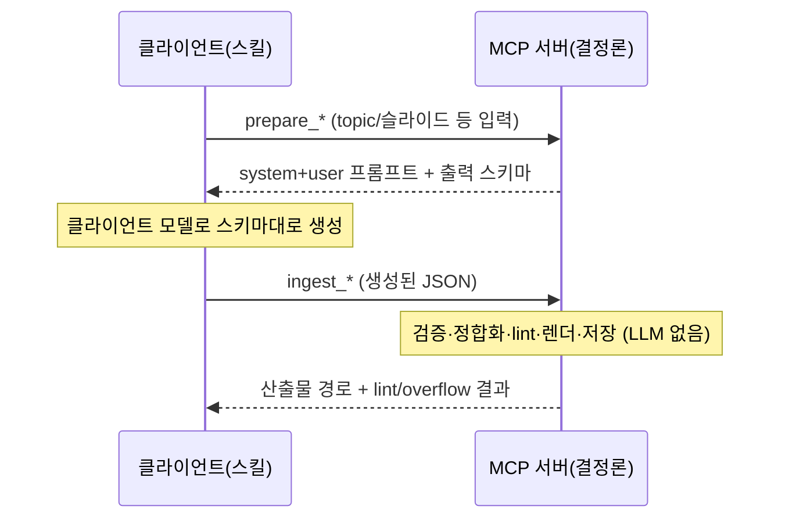

# LLM 생성을 클라이언트로 오프로딩 — 플러그인 + 스킬 + prepare/ingest 핸드셰이크

Date: 2026-07-01

## Status

Accepted (2026-07-01)

## Context

이 서버는 지금까지 자체적으로 LLM(Bedrock 또는 Anthropic 직접 API)을 호출해 왔다. outline·design spec·component 수정·design review·visual QA 각 단계가 서버 프로세스 안에서 프롬프트를 조립하고 모델을 부르고 응답을 파싱했다. 이 구조는 세 가지 비용을 강제한다.

1. **자격 증명·인프라 종속** — 서버를 돌리는 쪽이 AWS Bedrock 접근권 또는 Anthropic API 키를 갖고 있어야 한다. MCP 클라이언트(Claude Code 등)는 이미 자기 모델 접근권을 갖고 서버에 붙는데, 서버가 *또 다른* 모델 접근권을 요구해 이중 과금·이중 설정이 된다.
2. **모델·SDK 결합** — 프로바이더 분기(Bedrock/Anthropic), 모델 ID, thinking budget, structured_output SDK(strands)가 서버 코드에 박혀 있다. 클라이언트가 어떤 모델을 쓰든 서버가 고른 모델로 생성이 고정된다.
3. **가치의 위치 오인** — 이 프로젝트의 실제 자산은 "LLM 을 부르는 것"이 아니라, **프롬프트 설계 + 출력 스키마 + 결정론적 후처리**(Pydantic 검증, 5단 계층 정합화, 폰트 메트릭 오버플로우 방지, lint, design_doc 트리 재구성, HTML/PPTX 렌더)다. 토큰 생성은 클라이언트가 이미 잘 하는 일이다.

목표는 **동작을 그대로 유지한 채** 토큰 생성만 클라이언트로 옮기는 것이다. 생성 품질을 좌우하는 프롬프트·스키마·후처리는 한 글자도 바뀌지 않아야 하고, 프로젝트 디렉토리 산출물 포맷도 동일해야 한다.

참고 선례: 같은 저자의 ALPS 작성 MCP 서버는 LLM 을 전혀 호출하지 않는다 — 서버는 결정론적 템플릿/문서 IO 만 담당하고, 생성(대화·초안)은 전적으로 클라이언트가 스킬과 도구 설명(instructions)에 따라 수행한다. 그 서버가 검증된 오프로딩 형태를 제공한다.

### Decision Drivers

- **동작 불변** — 오프로딩 전후로 산출물(파일 포맷, 렌더 결과, lint 판정)이 동일해야 한다. 프롬프트·스키마·후처리 로직은 서버가 계속 소유한다.
- **클라이언트 모델 재사용** — 클라이언트가 이미 가진 모델 접근권으로 생성이 이뤄져야 한다. 서버는 Bedrock/Anthropic 자격 증명을 요구하지 않는다.
- **배포 형태** — Claude Code 사용자가 `/plugin` 으로 설치하고 스킬로 워크플로우를 밟을 수 있어야 한다. 서버는 stdio MCP 로 계속 뜬다.
- **결정론 자산 보존** — 검증(Pydantic), 정합화(clean_slide_spec), 트리 재구성(backfill), lint, 렌더는 결정론적이라 클라이언트로 나가면 재현성이 깨진다. 서버에 남긴다.
- **병렬성의 이전** — 슬라이드별 생성은 지금 서버가 스레드풀로 병렬화한다. 오프로딩 후에는 클라이언트(스킬)가 병렬성을 담당하므로, 서버 API 는 슬라이드 단위로 stateless 해야 한다.

## Decision

LLM 호출을 서버에서 제거하고, 각 생성 단계를 **prepare / ingest 두 도구로 분리**한다. 프롬프트 조립과 출력 후처리는 서버가 그대로 소유하고, 그 사이의 토큰 생성만 클라이언트가 수행한다. 저장소는 **단일 Claude Code 플러그인**으로 재구성한다.

### 1. prepare / ingest 핸드셰이크

생성이 필요한 각 도구를 두 개로 쪼갠다.

- **prepare_*** — 서버가 지금 LLM 에 보내던 것과 **동일한** system prompt + user prompt 를, 지금 강제하던 것과 **동일한** 출력 스키마(JSON Schema)와 함께 반환한다. 부작용 없음(프로젝트 시드 고정 등 결정론적 준비는 허용).
- **ingest_*** — 클라이언트가 스키마대로 생성해 돌려준 JSON 을 받아, 지금 `structured_output` 응답에 하던 것과 **동일한** 검증·후처리·저장을 수행한다.

프롬프트 텍스트와 스키마는 서버 안에 그대로 남으므로 프롬프트 엔지니어링의 소유권이 서버에 유지된다. 클라이언트는 "무엇을 어떤 형식으로 생성할지"를 서버에서 받아 그대로 따른다.

### 2. 슬라이드 단위 stateless — 병렬성은 클라이언트로

서버가 슬라이드 전체를 스레드풀로 병렬 생성하던 책임을 내려놓는다. prepare/ingest 는 슬라이드 하나 단위로 동작하고, 여러 슬라이드를 동시에 진행하는 것은 클라이언트(스킬)가 여러 prepare→생성→ingest 체인을 병렬로 돌려 담당한다. 서버는 슬라이드 인덱스별로 독립인 파일 IO 만 하므로 동시 ingest 가 안전하다(프로젝트 메타데이터 read-modify-write 만 보호).

### 3. 서버가 계속 소유하는 것 (LLM 없이 결정론)

- 프롬프트 텍스트·출력 스키마 (prepare 가 반환하는 소스)
- 출력 검증(Pydantic 모델), 정합화(clean_slide_spec), 5단 계층 데이터 무결성
- design_doc 트리 backfill 재구성(bbox 합집합·검증), component 부분 수정 적용
- lint(단계적·cross-layer), 폰트 메트릭 오버플로우 방지
- HTML/PPTX 렌더, PPTX import, 배경 이미지 결정론적 선택, 프로젝트 디렉토리 IO
- Visual QA 의 스크린샷 캡처(Playwright) — 이미지 생성은 결정론적 브라우저 렌더라 서버에 남고, 그 이미지에 대한 **비전 분석·수정만** 클라이언트로 나간다(이미지 파일 경로를 ingest 로 주고받는다).

### 4. 제거되는 것

- 프로바이더 분기, 모델 팩토리, strands Agent 생성, thinking budget, structured_output SDK 호출.
- 서버측 토큰 사용량 계측·비용 추정 — 생성이 클라이언트에서 일어나므로 서버가 셀 토큰이 없다. 응답의 `token_usage`/`estimated_cost` 필드도 사라진다.
- Visual QA 의 분석/수정 모델 이원화(Haiku/Sonnet) — 모델 선택은 클라이언트 몫이 된다.

### 5. 배포 형태 — 단일 플러그인

저장소 루트에 플러그인 매니페스트와 스킬을 추가한다. Python 패키지와 pyproject 는 현 위치를 유지하고, 플러그인은 서버를 기존 방식(uv 로 stdio 실행)으로 띄운다. 각 워크플로우(outline / design / modify / visual QA)마다 스킬을 두어, 클라이언트가 prepare→생성→ingest 순서와 병렬화·확인 규칙을 스킬 지시에 따라 밟게 한다.

## 대안 검토

| 대안 | pros | cons | 판정 |
|------|------|------|------|
| **prepare/ingest 2-툴 페어 (채택)** | 프롬프트·스키마·후처리가 서버에 그대로 남아 동작 불변. 클라이언트는 스키마를 받아 생성만. 슬라이드 단위 stateless 로 병렬성 이전이 자연스러움 | 도구 수가 대략 2배로 늘고, 한 작업이 두 번의 왕복이 됨 | 채택 — Decision Driver "동작 불변"·"결정론 자산 보존"을 정면으로 만족 |
| 프롬프트를 스킬로 이전, 서버는 조회/저장만 | 도구 수 최소, 서버가 아주 얇아짐 | 1800줄 프롬프트·출력 스키마가 스킬 마크다운으로 나가 서버의 Pydantic 검증과 이중 소스가 됨 → drift·재현성 붕괴. "동작 불변"에 정면 배치 | 기각 |
| 서버가 클라이언트 샘플링(MCP sampling)으로 역호출 | 기존 단일-툴 API 유지 | 클라이언트 샘플링 지원 편차가 크고, 서버가 여전히 생성 오케스트레이션을 소유해 "오프로딩" 목표가 절반만 달성. structured_output 등가물 부재 | 기각 |
| LLM 호출만 남기고 프로바이더 설정만 클라이언트 env 로 | 변경 최소 | 서버가 여전히 모델 접근권·SDK 를 요구 → Driver "클라이언트 모델 재사용" 미달 | 기각 |

## Consequences

### Positive

- 서버가 모델 자격 증명·프로바이더 SDK 없이 동작 — 설치·과금이 단순해진다.
- 생성 모델 선택이 클라이언트로 이양 — 클라이언트가 쓰는 최신 모델을 그대로 활용.
- 프롬프트·스키마·후처리가 서버에 남아 산출물 재현성과 lint 판정이 보존된다.
- 결정론 코어(렌더·lint·import·PPTX)는 손대지 않아 회귀 위험이 그 경계 밖으로 넘지 않는다.

### Negative / Risks

- 한 생성 작업이 두 번의 도구 왕복이 되어 프로토콜이 장황해진다 — 스킬이 순서를 강제해 완화.
- 클라이언트가 스키마를 어기고 생성하면 ingest 검증에서 실패한다 — 기존 structured_output 이 SDK 레벨에서 강제하던 것을 이제 서버 검증 + 스킬 지시가 대신한다. ingest 는 명확한 검증 에러로 재생성을 유도한다.
- 토큰/비용 가시성 상실 — 계측 위치가 클라이언트로 옮겨간다.
- 클라이언트가 병렬성을 담당 — 스킬이 병렬 생성 패턴을 안내해야 순차 생성으로 느려지지 않는다.

## Related

- [outline/0001](../outline/0001-outline-generation.md) — outline 생성이 prepare/ingest 로 분리됨
- [design/0001](../design/0001-design-spec-pipeline.md) — design spec 생성 파이프라인의 LLM 경계가 클라이언트로 이동
- [design/0003](../design/0003-parallel-design-spec.md) — 서버측 병렬 생성/thinking budget 결정이 이 ADR 로 대체됨
- [design/0008](../design/0008-design-spec-post-generation-review.md) — design review 의 LLM 호출이 클라이언트로 이동
- [modify/0003](../modify/0003-modify-component-mcp-tool.md), [modify/0004](../modify/0004-imported-slide-lazy-backfill.md) — 부분 수정·backfill 의 LLM 경계 이동
- [visual-qa/0001](../visual-qa/0001-visual-qa-pipeline.md), [visual-qa/0003](../visual-qa/0003-two-phase-model-split.md) — 스크린샷은 서버, 분석/수정은 클라이언트로. 모델 이원화 결정이 이 ADR 로 대체됨
- [project/0003](../project/0003-token-usage-cost-estimation.md) — 서버측 토큰/비용 추적이 이 ADR 로 대체됨
