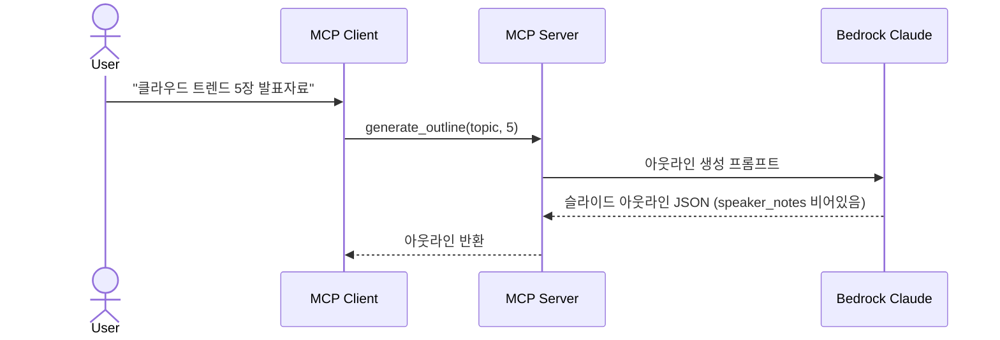

# 1. 슬라이드 아웃라인 생성 (F1)

Date: 2026-02-11

## Status

Accepted

## Context

사용자가 주제를 입력하면 최적의 슬라이드 구성을 빠르게 얻을 수 있도록, Bedrock LLM이 슬라이드 아웃라인 JSON을 자동 생성해야 한다.

파이프라인의 첫 단계로, 이 아웃라인은 이후 스크립트 생성(F2), 이미지 생성(F3), HTML 슬라이드 생성(F4)의 공통 입력으로 사용된다. speaker_notes는 빈 문자열로 생성되며, F2에서 채워진다.

## Decision

MCP 도구 `generate_outline`을 구현하여, 주제와 슬라이드 수를 입력받아 Bedrock Claude Opus 4.6이 구조화된 JSON 아웃라인을 생성한다. 기본적으로 `freeform` 모드(좌표 기반 자유 배치)로 동작하여, PPTX 변환 시 HTML로 표현한 디자인 자유도를 최대한 보장한다.

### Technical Details

- Bedrock Claude Opus 4.6 호출 (Strands SDK 경유)
- 프롬프트: 주제를 기반으로 구조화된 JSON 아웃라인 생성 요청
- 출력 JSON 스키마: `{ slides: [{ title, bullets: [], image_idea, layout_type, speaker_notes: "", elements: [] }] }`
- 기본 모드는 freeform: `elements[]` 배열로 요소별 좌표(인치 단위, 13.333 x 7.5인치 좌표계) 포함. PPTX 변환 시 HTML 디자인 자유도를 최대한 보장
- layout_type: 기본값 `freeform` (좌표 기반 자유 배치). placeholder 모드 사용 시 `title`, `text_image`, `text_only`, `chart`, `closing`
- speaker_notes는 빈 문자열로 생성되며, 이후 `generate_script`(F2)에서 채워짐

### MCP Tool Interface

| 항목 | 값 |
|------|-----|
| Tool | `generate_outline` |
| 입력 | `topic: str`, `num_slides: int` |
| 출력 | 아웃라인 JSON 문자열 (speaker_notes 비어있음) |

### Acceptance Criteria

1. 주제를 입력하면 구조화된 슬라이드 아웃라인 JSON이 반환된다
2. 각 슬라이드에 제목, 본문 요점, 이미지 아이디어, 레이아웃 타입이 포함된다
3. speaker_notes는 빈 문자열이다

### Out of Scope

- 문서/PDF 업로드 기반 아웃라인 생성 (Phase 2)

## Consequences

- F2(스크립트 생성), F3(이미지 생성), F4(HTML 슬라이드 생성)의 공통 입력으로 사용된다
- 주제가 너무 모호한 경우 LLM이 합리적으로 해석하여 생성한다
- 빈 주제 입력 시 입력 검증 후 에러 반환한다
- LLM이 유효하지 않은 JSON 반환 시 재시도 또는 에러 반환한다

## References

- 구현: `src/ppt_generator/tools/outline/` (controller.py, service.py)
- 스키마: `src/ppt_generator/interfaces/schemas.py` — `OutlineRequest(topic, num_slides)`, `OutlineResponse`
- 프롬프트: `src/ppt_generator/interfaces/constants.py` — `OUTLINE_FREEFORM_SYSTEM_PROMPT`
- ALPS: Section 7.1
