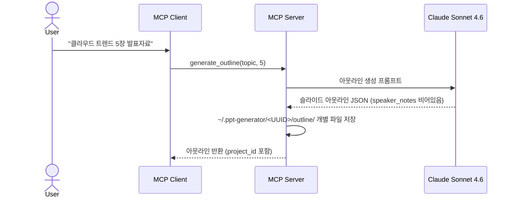

# 1. 슬라이드 아웃라인 생성 (F1)

Date: 2026-02-11

## Status

Accepted (Updated: layout_type → layout_index, freeform/elements 제거, Claude Sonnet 4.6 Extended Thinking (medium) 사용, component_hint 추가, 개별 JSON 파일 저장 + JSONL/JSON legacy fallback)

## Context

사용자가 주제를 입력하면 최적의 슬라이드 구성을 빠르게 얻을 수 있도록, Bedrock LLM이 슬라이드 아웃라인 JSON을 자동 생성해야 한다.

파이프라인의 첫 단계로, 이 아웃라인은 이후 스크립트 생성(F2), HTML 슬라이드 생성(F3)의 공통 입력으로 사용된다. speaker_notes는 빈 문자열로 생성되며, F2에서 채워진다.

## Decision

MCP 도구 `generate_outline`을 구현하여, 주제와 슬라이드 수를 입력받아 Bedrock Claude Sonnet 4.6 Extended Thinking (effort: medium)가 구조화된 JSON 아웃라인을 생성한다. 각 슬라이드에 `layout_index`(PPTX 템플릿 레이아웃 인덱스)와 `component_hint`(시각적 컴포넌트 유형)를 포함하여, HTML 슬라이드 생성 시 레이아웃 골격과 본문 구조를 결정한다.

### Technical Details

- Bedrock Claude Sonnet 4.6 Extended Thinking (effort: medium) 호출 (Strands SDK 경유, 16K max tokens)
- 프롬프트: 주제를 기반으로 구조화된 JSON 아웃라인 생성 요청
- 출력 JSON 스키마: `{ slides: [{ slide_index, title, content_summary, layout_index, component_hint, speaker_notes: "" }] }`
- 저장 형식: 개별 JSON 파일 (`outline/slide_01.json`, `outline/slide_02.json`, ...) — 슬라이드별 독립 파일, `slide_index` 명시 포함. 하위 호환: `outline.jsonl` → `outline.json` 순으로 fallback 지원
- `layout_index`: PPTX 템플릿 레이아웃 인덱스 (0=제목, 22=범용 콘텐츠, 21=차트, 87=마무리). 알 수 없는 인덱스는 22로 폴백
- `component_hint`: 본문 영역의 시각적 구조 힌트 (bullets, two_column, vs_comparison, step_cards, code_block, arch_diagram, pipeline, quote, summary_grid, agenda, info_cards, feature_list, cta, process_flow, quote_code, concept_list)
- speaker_notes는 빈 문자열로 생성되며, 이후 `generate_script`(F2)에서 채워짐
- 슬라이드 수: `num_slides` 직접 지정 또는 `presentation_minutes` 기반 자동 계산 (1~2분당 1장)
- **호출 전 필수 확인**: MCP 클라이언트는 호출 전에 사용자에게 `presentation_minutes`(발표 시간)와 `audience_type`(청중 유형)을 반드시 확인해야 함. 기본값 임의 사용 금지.

### MCP Tool Interface

| 항목 | 값 |
|------|-----|
| Tool | `generate_outline` |
| 입력 | `topic: str`, `audience_type: str` ("general"/"technical"/"executive"), `presentation_minutes: int` (3~60), `num_slides: int` (0이면 자동 계산), `project_id: str` (선택) |
| 출력 | 아웃라인 JSON 문자열 (speaker_notes 비어있음, project_id 포함) |

### Acceptance Criteria

1. 주제를 입력하면 구조화된 슬라이드 아웃라인 JSON이 반환된다
2. 각 슬라이드에 제목(title), 내용 요약(content_summary), 레이아웃 인덱스(layout_index), 컴포넌트 힌트(component_hint)가 포함된다
3. speaker_notes는 빈 문자열이다
4. project_id가 자동 생성되어 `~/.ppt-generator/<UUID>/`에 결과물이 저장된다

### Out of Scope

- 문서/PDF 업로드 기반 아웃라인 생성 (Phase 2)

## Consequences

- F2(스크립트 생성), F3(HTML 슬라이드 생성)의 공통 입력으로 사용된다
- 주제가 너무 모호한 경우 LLM이 합리적으로 해석하여 생성한다
- 빈 주제 입력 시 입력 검증 후 에러 반환한다
- LLM이 유효하지 않은 JSON 반환 시 재시도 또는 에러 반환한다

## References

- 구현: `src/ppt_generator/tools/outline/` (controller.py, service.py)
- 스키마: `src/ppt_generator/interfaces/schemas.py` — `OutlineRequest(topic, num_slides)`, `OutlineResponse`, `SlideOutline(title, content_summary, layout_index, component_hint, speaker_notes, slide_index)`
- 프롬프트: `src/ppt_generator/interfaces/prompts/` — `OUTLINE_SYSTEM_PROMPT`, `OUTLINE_USER_PROMPT_TEMPLATE` (`constants.py`에서 re-export)
- ALPS: Section 7.1
