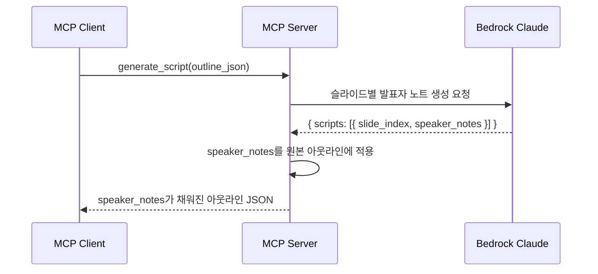

# 2. 발표 스크립트 생성 (F2)

Date: 2026-02-11

## Status

Accepted

## Context

F1에서 생성한 아웃라인 JSON의 speaker_notes는 비어있다. 각 슬라이드의 제목과 본문 요점을 기반으로 자연스러운 발표자 노트를 생성하여 speaker_notes를 채워야 한다.

이 단계를 거치면 아웃라인에 발표자 노트가 포함되어, F4에서 HTML 슬라이드 생성 시 `data-speaker-notes` 속성에 반영할 수 있다.

## Decision

MCP 도구 `generate_script`를 구현하여, 아웃라인 JSON을 입력받아 Bedrock Claude Opus 4.6이 슬라이드별 발표자 노트를 생성하고, speaker_notes가 채워진 아웃라인 JSON을 반환한다.

### Technical Details

- Bedrock Claude Opus 4.6 호출 (Strands SDK 경유)
- 프롬프트: 아웃라인 JSON을 기반으로 슬라이드별 발표자 노트(speaker_notes) 생성 요청
- LLM 출력 JSON 스키마: `{ scripts: [{ slide_index, speaker_notes }] }`
- 출력의 speaker_notes를 원본 아웃라인의 각 슬라이드에 적용하여 최종 아웃라인 JSON 반환

### MCP Tool Interface

| 항목 | 값 |
|------|-----|
| Tool | `generate_script` |
| 입력 | `outline_json: str` (speaker_notes 비어있는 아웃라인) |
| 출력 | 아웃라인 JSON 문자열 (speaker_notes 채워짐) |

### Acceptance Criteria

1. 아웃라인 JSON을 입력하면 speaker_notes가 채워진 아웃라인 JSON이 반환된다
2. 각 슬라이드의 speaker_notes가 해당 슬라이드 내용에 맞는 자연스러운 발표 스크립트를 포함한다
3. 슬라이드 간 자연스러운 전환이 반영된다

### Out of Scope

- 사용자가 직접 speaker_notes를 편집하는 기능 (MCP 클라이언트에서 JSON 수정으로 가능)

## Consequences

- 반환되는 아웃라인 JSON은 F1의 출력과 동일한 스키마이며, speaker_notes만 채워져 있다
- 이후 F3, F4에서 이 아웃라인 JSON을 그대로 사용할 수 있다
- 아웃라인이 비어있는 경우 입력 검증 후 에러 반환한다
- LLM이 유효하지 않은 JSON 반환 시 재시도 또는 에러 반환한다
- 일부 슬라이드의 speaker_notes가 누락된 경우 기존 값(빈 문자열) 유지한다

## References

- 구현: `src/ppt_generator/tools/script/` (controller.py, service.py)
- 스키마: `src/ppt_generator/interfaces/schemas.py` — `ScriptRequest(outline)`, `ScriptResponse(slides)`
- 프롬프트: `src/ppt_generator/interfaces/constants.py` — `SCRIPT_SYSTEM_PROMPT`, `SCRIPT_USER_PROMPT_TEMPLATE`
- 관련 ADR: [0001-outline-generation](./0001-outline-generation.md)
- ALPS: Section 7.2
