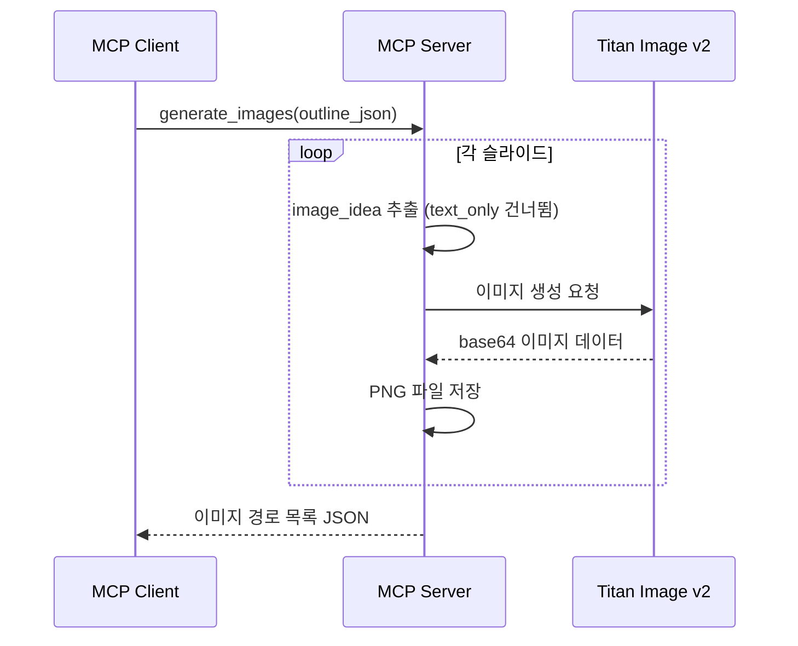

# 3. 이미지 생성 (F3)

Date: 2026-02-11

## Status

Accepted

## Context

슬라이드에 어울리는 시각 자료를 자동 생성하여, 사용자가 이미지를 직접 찾거나 만들 필요 없이 시각적으로 완성된 슬라이드를 얻을 수 있어야 한다.

아웃라인(F1/F2 출력)의 `image_idea` 필드를 기반으로 일관된 스타일의 이미지를 생성한다.

## Decision

MCP 도구 `generate_images`를 구현하여, Amazon Titan Image Generator v2로 각 슬라이드의 `image_idea`에 맞는 이미지를 생성한다. 이미지가 필요 없는 슬라이드(`text_only`)는 건너뛴다.

### Technical Details

- Amazon Bedrock Titan Image Generator v2 (`amazon.titan-image-generator-v2:0`)
- 이미지 크기: 1280 x 768px
- CFG Scale: 8.0
- image_idea를 영어 프롬프트로 변환하여 요청
- 색상 팔레트 조건을 통해 슬라이드 전반의 이미지 스타일 통일
- 출력: PNG 파일로 로컬 임시 디렉토리에 저장 (`tempfile.mkdtemp(prefix="ppt_images_")`)
- 이미지는 HTML 슬라이드에서 base64 인코딩 또는 파일 경로로 참조
- `SKIP_IMAGE_LAYOUT_TYPES`에 정의된 layout_type(`text_only`)은 건너뜀

### MCP Tool Interface

| 항목 | 값 |
|------|-----|
| Tool | `generate_images` |
| 입력 | `outline_json: str` (슬라이드 아웃라인) |
| 출력 | 생성된 이미지 파일 경로 목록 JSON 문자열 |

### Acceptance Criteria

1. 아웃라인의 image_idea에 따라 슬라이드별 이미지가 생성된다
2. 생성된 이미지들이 일관된 스타일을 유지한다
3. 이미지가 필요 없는 슬라이드는 건너뛴다
4. 이미지 파일 경로 목록이 반환된다

### Out of Scope

- 사용자 업로드 이미지 활용
- 브랜드 팔레트 커스터마이징

## Consequences

- 생성된 이미지 파일은 임시 디렉토리에 저장되어, 서버 재시작 시 소실될 수 있다
- Titan Image API 호출 실패 시 해당 슬라이드는 이미지 없이 진행, 에러 로그 기록
- image_idea가 없는 슬라이드는 이미지 생성 건너뜀
- F4에서 이미지를 base64 data URI로 HTML에 삽입한다

## References

- 구현: `src/ppt_generator/tools/images/` (controller.py, service.py)
- 스키마: `src/ppt_generator/interfaces/schemas.py` — `ImageRequest`, `ImageResult`, `ImageResponse`
- 상수: `src/ppt_generator/interfaces/constants.py` — `TITAN_IMAGE_*`, `SKIP_IMAGE_LAYOUT_TYPES`
- ALPS: Section 7.3
