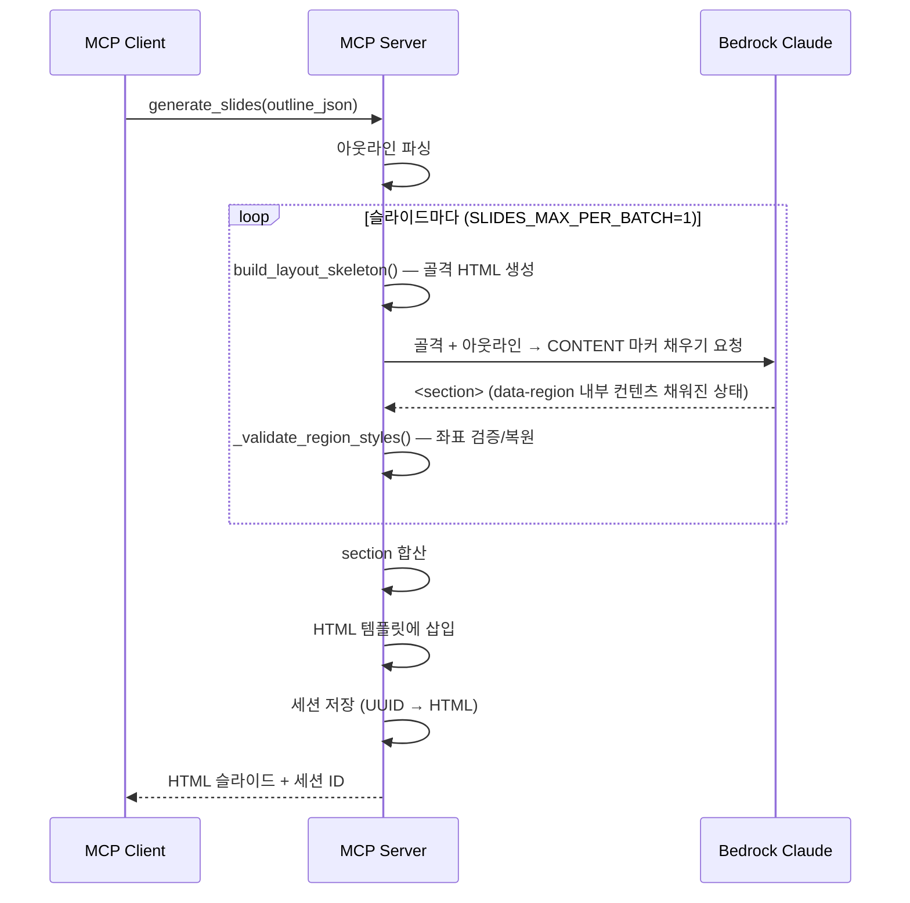

# 4. HTML 슬라이드 생성 (F3)

Date: 2026-02-11

## Status

Accepted (Updated: reveal.js 제거 → 정적 HTML 수직 스크롤 → 레이아웃 골격 기반 위치 강제 → 이미지 생성 기능 제거 → layout_index 기반 + component_hint + css_inliner, 디자인 스펙 결정론적 변환 경로 추가 [ADR-0013](./0013-design-spec-pipeline.md) 참조)

## Context

아웃라인(F1/F2)을 기반으로 전문적인 디자인의 슬라이드를 생성해야 한다. python-pptx로 직접 생성하면 레이아웃 제약(고정 플레이스홀더, 제한된 CSS 스타일링)이 있어 자유로운 디자인이 어렵다.

HTML/CSS 기반으로 슬라이드를 생성하면 LLM의 코드 생성 능력을 활용하여 자유로운 레이아웃과 고품질 디자인을 달성할 수 있다. 세션 ID를 부여하여 이후 수정(F4)과 PPTX 내보내기(F5)에서 활용한다.

기존 reveal.js 방식은 프레임워크의 내부 레이아웃 엔진(`display: flex`, 자동 센터링, 스케일링)이 LLM이 생성한 Tailwind CSS 레이아웃과 충돌하여 배경색 누락, 콘텐츠 오버플로우 등 레이아웃이 깨지는 문제가 있었다. reveal.js를 제거하고 JavaScript 없는 순수 HTML/CSS 방식으로 전환하여, 각 슬라이드를 1280x720px 고정 크기 `<section>`으로 수직 스크롤 형태로 표시한다.

## Decision

MCP 도구 `generate_slides`를 구현하여, Bedrock LLM이 HTML/CSS 슬라이드를 생성한다. `LAYOUT_REGIONS` 좌표를 기반으로 `position:absolute` div 골격(skeleton)을 코드로 생성하고, LLM은 각 `data-region` div 내부 컨텐츠만 채운다. 후처리로 좌표를 검증/복원한 뒤, HTML 템플릿(`slides.html`)에 삽입하여 완전한 HTML 문서를 구성한다. JavaScript 없이 순수 HTML/CSS + TailwindCSS만으로 슬라이드를 렌더링한다.

### Technical Details

- Bedrock Claude Opus 4.6 호출 (Strands SDK 경유)
- **TailwindCSS v4 Browser** 기반 (jsdelivr.net CDN)
- 슬라이드 규격: 1280 x 720px (16:9)
- HTML 구조: `<body>` 안에 `<section id="slide-{N}" data-speaker-notes="...">` 요소들이 수직으로 나열
- 각 section은 `position: relative; width: 1280px; height: 720px; overflow: hidden` 고정
- 래퍼 div(`data-wrapper="true"`)에 `absolute inset-0`을 사용하여 슬라이드 영역 전체를 커버
- 래퍼 div 안에 `data-region` div들이 `position:absolute`로 고정 좌표에 배치
- `data-region` div: `title`, `subtitle`, `body` 등 영역별 마커
- LLM은 각 `data-region` div 내부의 `<!-- CONTENT:xxx -->` 마커를 실제 HTML로 교체
- 발표자 노트는 `data-speaker-notes` 속성에 포함
- 세션 관리: 세션 ID로 현재 HTML 슬라이드 상태를 서버 메모리에 유지 (수정 루프 지원)
- 한글 폰트: Pretendard, Noto Sans KR

### 템플릿 분리 전략

- **HTML 템플릿**: `src/ppt_generator/templates/slides.html`
  - TailwindCSS v4 Browser CDN
  - 기본 폰트 설정 (`Pretendard`, `Noto Sans KR`)
  - section 기본 스타일 (1280x720px, 둥근 모서리, 그림자)
  - `{slides_content}` placeholder: LLM이 생성한 `<section>` 요소들 삽입
  - 슬라이드 번호 표시: JavaScript로 각 section을 `.slide-wrapper`로 감싸고 "N / 총수" 라벨 자동 생성
- **서비스 역할**: (1) `build_layout_skeleton()`으로 골격 HTML 생성 → (2) LLM에 골격과 아웃라인 전달 → (3) LLM 응답에서 section 추출 → (4) `_validate_region_styles()`로 좌표 검증/복원 → (5) 템플릿에 삽입
- **LLM 역할**: 골격의 `<!-- CONTENT:xxx -->` 마커를 실제 HTML 콘텐츠로 교체. `data-region` div의 style 속성은 변경 금지

### Layout Region Constraints — 골격(Skeleton) 기반 위치 강제

PPTX 템플릿의 placeholder 위치를 python-pptx로 추출하여 1280x720px HTML 좌표로 변환한 뒤, `LAYOUT_REGIONS` 딕셔너리에 저장한다. 이 좌표를 사용하여 `build_layout_skeleton()` 함수가 `position:absolute` div 골격을 코드로 생성하고, LLM은 각 `data-region` div 내부 컨텐츠만 채운다.

- **추출 도구**: `scripts/extract_layout_positions.py` — 1회성 스크립트로 AWS 템플릿의 6개 레이아웃에서 placeholder 위치 추출
- **변환 공식**: `px_x = inches * (1280/13.333)`, `px_y = inches * (720/7.5)`
- **적용 위치**: `constants.py`의 `LAYOUT_REGIONS` 딕셔너리 + `build_layout_skeleton()` 함수
- **적용 방식**: 코드로 골격 HTML을 생성하여 좌표를 구조적으로 강제. LLM이 좌표를 변경하더라도 `_validate_region_styles()`가 원본 좌표로 복원

**골격 생성 → LLM 컨텐츠 채우기 → 좌표 검증 흐름:**

```
build_layout_skeleton()          → <section> 골격 HTML (data-region div + position:absolute)
    ↓
LLM (SLIDES_REGION_SYSTEM_PROMPT) → <!-- CONTENT:xxx --> 마커를 실제 HTML로 교체
    ↓
_validate_region_styles()         → data-region div의 좌표를 LAYOUT_REGIONS 원본으로 복원
    ↓
_wrap_with_template()             → HTML 템플릿에 삽입
```

**골격 HTML 구조 예시:**

```html
<section id="slide-0" data-speaker-notes="...">
  <div data-wrapper="true" class="absolute inset-0 bg-slate-900" style="background-color:#0f172a;">
    <div data-region="title" style="position:absolute; left:57px; top:96px; width:1152px; height:56px; overflow:hidden;">
      <h2 class="text-white text-3xl font-bold">제목 텍스트</h2>
    </div>
    <div data-region="body" style="position:absolute; left:64px; top:180px; width:1152px; height:472px; overflow:hidden;">
      <p class="text-white text-lg">본문 컨텐츠</p>
    </div>
  </div>
</section>
```

주요 레이아웃 및 영역 (LAYOUT_REGIONS에서 좌표 로드):
| layout_index | 영역(data-region) | 특징 |
|-------------|-------------------|------|
| 0 (title) | title, subtitle, body | 중앙 정렬, 부제목 포함 |
| 22 (범용 콘텐츠) | title, body | 전체폭 본문, 높이 자동 조절 |
| 21 (차트) | title, body | 전체폭 데이터 시각화 |
| 87 (마무리) | body | 작은 본문 영역, 중앙 텍스트 추가 가능 |

> 전체 레이아웃 좌표는 `template/layout.json`에서 로드되며, `constants.py`의 `_load_layout_regions()`로 초기화됩니다.

### Alternatives Considered

- **plain HTML 방식 (폐기)**: `<div class="slide">` + 인라인 CSS + `position: absolute` → LLM의 자유 해석으로 일관성 부족
- **reveal.js 방식 (폐기)**: reveal.js 프레임워크 기반 → 내부 레이아웃 엔진(display:flex, 자동 센터링/스케일링)이 LLM이 생성한 Tailwind CSS와 충돌하여 배경색 누락, 콘텐츠 오버플로우 등 레이아웃 깨짐 발생. CSS `!important` 오버라이드로도 안정적 해결 불가
- **reveal.js 전체 HTML 생성 (폐기)**: LLM이 CDN 링크, 초기화 코드까지 모두 생성 → 프롬프트 토큰 낭비, CDN URL 오류 가능성

### HTML 추출 전략

LLM 응답에서 `<section>` 요소를 추출하는 3단계 fallback:
1. 마크다운 코드블록에서 추출
2. 완전한 HTML 문서가 반환된 경우 `<section>` 태그만 추출
3. `<section>` 태그가 직접 포함된 경우 regex로 추출

### 디자인 스펙 결정론적 변환 경로 (신규)

[ADR-0013](./0013-design-spec-pipeline.md)에서 도입된 **디자인 스펙(PptxSlideSpec JSON)** 입력 경로가 추가되었다. `design_spec_json` 파라미터가 제공되면 LLM 호출 없이 `SlidesService.generate_from_design_spec()`으로 position:absolute HTML을 결정론적으로 생성한다.

```
디자인 스펙 경로: DesignSpec → position:absolute HTML 결정론적 변환 (LLM 미사용)
기존 HTML 경로:  아웃라인 → 골격 생성 → LLM 콘텐츠 채우기 → 좌표 검증 (하위 호환 유지)
```

### MCP Tool Interface

| 항목 | 값 |
|------|-----|
| Tool | `generate_slides` |
| 입력 | `outline_json: str` (기존 HTML 경로) 또는 `design_spec_json: str` (디자인 스펙 경로), `project_id: str` (선택) |
| 출력 | session_id, slides_html_path, project_id를 포함하는 JSON |

### Acceptance Criteria

1. 아웃라인을 입력하면 HTML 슬라이드가 생성된다
2. 각 슬라이드가 layout_index에 맞는 골격 좌표와 component_hint에 맞는 시각적 구조를 갖는다
3. 발표자 노트가 `data-speaker-notes` 속성에 포함되어 있다
5. 세션 ID가 반환되어 이후 수정/내보내기에 사용할 수 있다
6. 브라우저에서 HTML 파일을 열면 슬라이드가 수직으로 나열되어 스크롤로 확인 가능하다
7. 각 section에 `id="slide-{N}"` 속성이 포함되어 파싱이 용이하다

### Out of Scope

- 아웃라인이 매우 많은 슬라이드를 포함하는 경우의 분할 처리 (LLM 토큰 한도)



## Consequences

- F4(수정)에서 세션 ID로 HTML 상태 접근/갱신 가능
- F5(PPTX 내보내기)에서 세션의 최종 HTML을 파싱하여 변환 가능 (`<section>` 태그 기반 파싱)
- LLM이 유효하지 않은 section 반환 시 fallback으로 텍스트 반환
- 세션은 메모리 기반이므로 서버 재시작 시 소실된다 (영속화는 별도 ADR 참조)
- 브라우저에서 HTML 파일을 직접 열어 슬라이드를 수직 스크롤로 확인할 수 있다
- JavaScript 없이 순수 HTML/CSS로만 구성되어 오프라인에서도 안정적으로 렌더링된다 (TailwindCSS CDN만 필요)
- reveal.js의 프레젠테이션 모드(키보드 네비게이션, 슬라이드 번호)는 더 이상 지원하지 않지만, HTML의 목적이 디자인 미리보기와 PPTX 변환용 중간 산출물이므로 문제없다

## References

- 구현: `src/ppt_generator/tools/slides/` (controller.py, service.py, css_inliner.py)
- 템플릿: `src/ppt_generator/templates/slides.html`
- 스키마: `src/ppt_generator/interfaces/schemas.py` — `SlidesRequest`, `SlidesResponse`
- 골격 생성: `src/ppt_generator/interfaces/constants.py` — `build_layout_skeleton()`, `LAYOUT_REGIONS`
- 프롬프트: `src/ppt_generator/interfaces/constants.py` — `SLIDES_REGION_SYSTEM_PROMPT`, `SLIDES_REGION_USER_PROMPT_TEMPLATE`
- 좌표 검증: `src/ppt_generator/tools/slides/service.py` — `_validate_region_styles()`
- 관련 ADR: [0007-pipeline-artifact-persistence](./0007-pipeline-artifact-persistence.md), [0012-layout-skeleton-enforcement](./0012-layout-skeleton-enforcement.md), [0013-design-spec-pipeline](./0013-design-spec-pipeline.md)
- ALPS: Section 7.3
