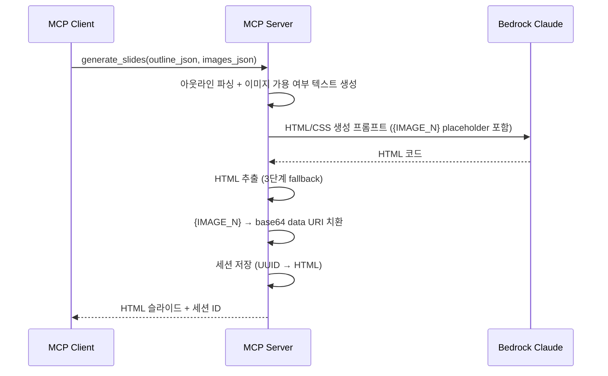

# 4. HTML 슬라이드 생성 (F4)

Date: 2026-02-11

## Status

Accepted

## Context

아웃라인(F1/F2)과 이미지(F3)를 결합하여 전문적인 디자인의 슬라이드를 생성해야 한다. python-pptx로 직접 생성하면 레이아웃 제약(고정 플레이스홀더, 제한된 CSS 스타일링)이 있어 자유로운 디자인이 어렵다.

HTML/CSS 기반으로 슬라이드를 생성하면 LLM의 코드 생성 능력을 활용하여 자유로운 레이아웃과 고품질 디자인을 달성할 수 있다. 세션 ID를 부여하여 이후 수정(F5)과 PPTX 내보내기(F6)에서 활용한다.

## Decision

MCP 도구 `generate_slides`를 구현하여, Bedrock LLM이 960x540px 규격의 HTML/CSS 슬라이드를 생성한다. 이미지는 Placeholder 방식으로 처리하여 토큰 사용을 절약한다.

### Technical Details

- Bedrock Claude Opus 4.6 호출 (Strands SDK 경유)
- 슬라이드 규격: 960 x 540px (16:9)
- HTML 구조: `
`, 인라인 CSS, `position: absolute` 기반 자유 배치
- 이미지는 base64 data URI 또는 로컬 파일 경로로 삽입
- 발표자 노트는 `data-speaker-notes` 속성 또는 별도 `<aside>` 태그에 포함
- 세션 관리: 세션 ID로 현재 HTML 슬라이드 상태를 서버 메모리에 유지 (수정 루프 지원)
- 한글 폰트: Pretendard, Noto Sans KR

### Alternatives Considered

- **이미지 직접 삽입 방식**: 프롬프트에 base64를 직접 포함 → 토큰 급증으로 탈락
- **Placeholder 방식 (채택)**: LLM에는 `{IMAGE_N}` placeholder만 전달, LLM이 `` 형태로 생성 → 후처리로 실제 data URI 치환

### HTML 추출 전략

LLM 응답에서 HTML을 추출하는 3단계 fallback:
1. 마크다운 코드블록에서 추출
2. `<!DOCTYPE html>` 또는 `<html>` 태그로 시작하는 부분 추출
3. `
` 태그 감지 시 기본 HTML 구조로 감싸기

### MCP Tool Interface

| 항목 | 값 |
|------|-----|
| Tool | `generate_slides` |
| 입력 | `outline_json: str` (슬라이드 아웃라인), `images_json: str` (이미지 경로) |
| 출력 | HTML 슬라이드 (파일 경로 또는 HTML 문자열), 세션 ID 포함 |

### Acceptance Criteria

1. 아웃라인과 이미지를 입력하면 HTML/CSS 슬라이드가 생성된다
2. 각 슬라이드가 layout_type에 맞는 자유로운 디자인을 갖는다
3. 이미지가 적절한 위치에 삽입되어 있다
4. 발표자 노트가 포함되어 있다
5. 세션 ID가 반환되어 이후 수정/내보내기에 사용할 수 있다
6. MCP 클라이언트에서 HTML 슬라이드를 시각적으로 확인할 수 있다

### Out of Scope

- 아웃라인이 매우 많은 슬라이드를 포함하는 경우의 분할 처리 (LLM 토큰 한도)

## Consequences

- F5(수정)에서 세션 ID로 HTML 상태 접근/갱신 가능
- F6(PPTX 내보내기)에서 세션의 최종 HTML을 파싱하여 변환 가능
- 이미지 파일이 누락된 경우 해당 슬라이드는 텍스트만으로 구성
- LLM이 유효하지 않은 HTML 반환 시 기본 구조로 감싸서 반환하거나 재시도
- 세션은 메모리 기반이므로 서버 재시작 시 소실된다 (영속화는 별도 ADR 참조)

## References

- 구현: `src/ppt_generator/tools/slides/` (controller.py, service.py)
- 스키마: `src/ppt_generator/interfaces/schemas.py` — `SlidesRequest`, `SlidesResponse`
- 프롬프트: `src/ppt_generator/interfaces/constants.py` — `SLIDES_SYSTEM_PROMPT`, `SLIDES_USER_PROMPT_TEMPLATE`
- 관련 ADR: [0007-pipeline-artifact-persistence](./0007-pipeline-artifact-persistence.md)
- ALPS: Section 7.4
