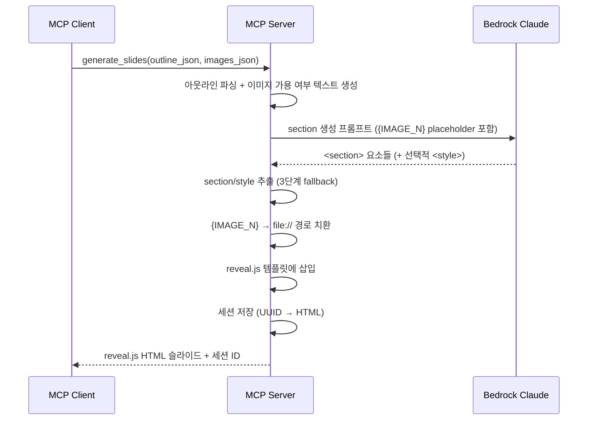

# 4. HTML 슬라이드 생성 (F4)

Date: 2026-02-11

## Status

Accepted (Updated: reveal.js 기반으로 전환)

## Context

아웃라인(F1/F2)과 이미지(F3)를 결합하여 전문적인 디자인의 슬라이드를 생성해야 한다. python-pptx로 직접 생성하면 레이아웃 제약(고정 플레이스홀더, 제한된 CSS 스타일링)이 있어 자유로운 디자인이 어렵다.

HTML/CSS 기반으로 슬라이드를 생성하면 LLM의 코드 생성 능력을 활용하여 자유로운 레이아웃과 고품질 디자인을 달성할 수 있다. 세션 ID를 부여하여 이후 수정(F5)과 PPTX 내보내기(F6)에서 활용한다.

기존 plain HTML 방식(`
`)은 LLM이 슬라이드 구조를 자유롭게 해석하여 일관성 없는 결과를 생성하는 경향이 있었다. reveal.js 프레임워크를 도입하여 슬라이드 구조를 표준화하고, 브라우저에서 바로 프레젠테이션으로 열람 가능하도록 한다.

## Decision

MCP 도구 `generate_slides`를 구현하여, Bedrock LLM이 reveal.js 프레임워크 기반의 HTML/CSS 슬라이드를 생성한다. LLM은 `<section>` 요소들만 생성하고, 서비스 레이어에서 reveal.js 템플릿(`slides_reveal.html`)에 삽입하여 완전한 프레젠테이션 문서를 구성한다.

### Technical Details

- Bedrock Claude Opus 4.6 호출 (Strands SDK 경유)
- **reveal.js 5 CDN** 기반 (jsdelivr.net)
- 슬라이드 규격: 960 x 540px (16:9, reveal.js `width`/`height` 설정)
- HTML 구조: `

<section data-speaker-notes="...">`, CSS 레이아웃 기반 배치
- 이미지는 `{IMAGE_N}` placeholder → 후처리로 `file://` 경로 치환
- 발표자 노트는 `data-speaker-notes` 속성에 포함
- 세션 관리: 세션 ID로 현재 HTML 슬라이드 상태를 서버 메모리에 유지 (수정 루프 지원)
- 한글 폰트: Pretendard, Noto Sans KR

### 템플릿 분리 전략

- **reveal.js 템플릿**: `src/ppt_generator/templates/slides_reveal.html`
  - CDN 링크 (reveal.css, theme/white.css, reveal.js)
  - 기본 폰트 설정 (`Pretendard`, `Noto Sans KR`)
  - `Reveal.initialize()` 설정 (`hash: true`, `slideNumber: true`)
  - `{custom_style}` placeholder: LLM이 생성한 `<style>` 태그 삽입
  - `{slides_content}` placeholder: LLM이 생성한 `<section>` 요소들 삽입
- **LLM 역할**: `<section>` 요소들과 선택적 `<style>` 태그만 생성
- **서비스 역할**: LLM 응답에서 section/style을 추출하여 템플릿에 삽입

### Alternatives Considered

- **이미지 직접 삽입 방식**: 프롬프트에 base64를 직접 포함 → 토큰 급증으로 탈락
- **Placeholder 방식 (채택)**: LLM에는 `{IMAGE_N}` placeholder만 전달, LLM이 `` 형태로 생성 → 후처리로 실제 파일 경로 치환
- **plain HTML 방식 (폐기)**: `
` + 인라인 CSS + `position: absolute` → LLM의 자유 해석으로 일관성 부족, 브라우저에서 프레젠테이션 형태로 볼 수 없음
- **reveal.js 전체 HTML 생성 (폐기)**: LLM이 CDN 링크, 초기화 코드까지 모두 생성 → 프롬프트 토큰 낭비, CDN URL 오류 가능성

### HTML 추출 전략

LLM 응답에서 `<section>` 요소를 추출하는 3단계 fallback:
1. 마크다운 코드블록에서 추출
2. 완전한 HTML 문서가 반환된 경우 `<section>` 태그만 추출
3. `<section>` 태그가 직접 포함된 경우 regex로 추출

### MCP Tool Interface

| 항목 | 값 |
|------|-----|
| Tool | `generate_slides` |
| 입력 | `outline_json: str` (슬라이드 아웃라인), `images_json: str` (이미지 경로) |
| 출력 | reveal.js HTML 슬라이드 (파일 경로 또는 HTML 문자열), 세션 ID 포함 |

### Acceptance Criteria

1. 아웃라인과 이미지를 입력하면 reveal.js 기반 HTML 슬라이드가 생성된다
2. 각 슬라이드가 layout_type에 맞는 디자인을 갖는다
3. 이미지가 적절한 위치에 삽입되어 있다
4. 발표자 노트가 포함되어 있다
5. 세션 ID가 반환되어 이후 수정/내보내기에 사용할 수 있다
6. 브라우저에서 HTML 파일을 열면 reveal.js 프레젠테이션으로 동작한다
7. 슬라이드 번호와 키보드 네비게이션이 지원된다

### Out of Scope

- 아웃라인이 매우 많은 슬라이드를 포함하는 경우의 분할 처리 (LLM 토큰 한도)

## Consequences

- F5(수정)에서 세션 ID로 HTML 상태 접근/갱신 가능
- F6(PPTX 내보내기)에서 세션의 최종 HTML을 파싱하여 변환 가능 (`<section>` 태그 기반 파싱)
- 이미지 파일이 누락된 경우 해당 슬라이드는 텍스트만으로 구성
- LLM이 유효하지 않은 section 반환 시 fallback으로 텍스트 반환
- 세션은 메모리 기반이므로 서버 재시작 시 소실된다 (영속화는 별도 ADR 참조)
- 브라우저에서 HTML 파일을 직접 열어 프레젠테이션을 확인할 수 있다
- reveal.js CDN 의존성으로 오프라인 환경에서는 프레젠테이션 렌더링이 제한될 수 있다

## References

- 구현: `src/ppt_generator/tools/slides/` (controller.py, service.py)
- 템플릿: `src/ppt_generator/templates/slides_reveal.html`
- 스키마: `src/ppt_generator/interfaces/schemas.py` — `SlidesRequest`, `SlidesResponse`
- 프롬프트: `src/ppt_generator/interfaces/constants.py` — `SLIDES_SYSTEM_PROMPT`, `SLIDES_USER_PROMPT_TEMPLATE`
- 관련 ADR: [0007-pipeline-artifact-persistence](./0007-pipeline-artifact-persistence.md)
- ALPS: Section 7.4
