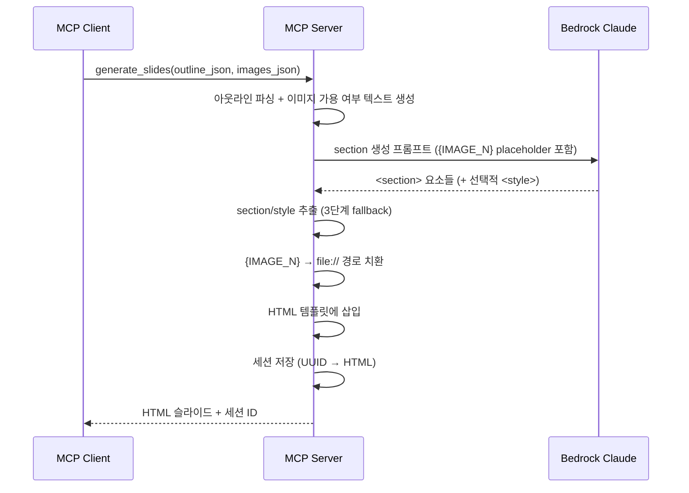

# 4. HTML 슬라이드 생성 (F4)

Date: 2026-02-11

## Status

Accepted (Updated: reveal.js 제거, 정적 HTML 수직 스크롤 방식으로 전환)

## Context

아웃라인(F1/F2)과 이미지(F3)를 결합하여 전문적인 디자인의 슬라이드를 생성해야 한다. python-pptx로 직접 생성하면 레이아웃 제약(고정 플레이스홀더, 제한된 CSS 스타일링)이 있어 자유로운 디자인이 어렵다.

HTML/CSS 기반으로 슬라이드를 생성하면 LLM의 코드 생성 능력을 활용하여 자유로운 레이아웃과 고품질 디자인을 달성할 수 있다. 세션 ID를 부여하여 이후 수정(F5)과 PPTX 내보내기(F6)에서 활용한다.

기존 reveal.js 방식은 프레임워크의 내부 레이아웃 엔진(`display: flex`, 자동 센터링, 스케일링)이 LLM이 생성한 Tailwind CSS 레이아웃과 충돌하여 배경색 누락, 콘텐츠 오버플로우 등 레이아웃이 깨지는 문제가 있었다. reveal.js를 제거하고 JavaScript 없는 순수 HTML/CSS 방식으로 전환하여, 각 슬라이드를 1280x720px 고정 크기 `<section>`으로 수직 스크롤 형태로 표시한다.

## Decision

MCP 도구 `generate_slides`를 구현하여, Bedrock LLM이 HTML/CSS 슬라이드를 생성한다. LLM은 `<section>` 요소들만 생성하고, 서비스 레이어에서 HTML 템플릿(`slides.html`)에 삽입하여 완전한 HTML 문서를 구성한다. JavaScript 없이 순수 HTML/CSS + TailwindCSS만으로 슬라이드를 렌더링한다.

### Technical Details

- Bedrock Claude Opus 4.6 호출 (Strands SDK 경유)
- **TailwindCSS v4 Browser** 기반 (jsdelivr.net CDN)
- 슬라이드 규격: 1280 x 720px (16:9)
- HTML 구조: `<body>` 안에 `<section id="slide-{N}" data-speaker-notes="...">` 요소들이 수직으로 나열
- 각 section은 `position: relative; width: 1280px; height: 720px; overflow: hidden` 고정
- 래퍼 div에 `absolute inset-0`을 사용하여 슬라이드 영역 전체를 커버
- 이미지는 `{IMAGE_N}` placeholder → 후처리로 `file://` 경로 치환
- 발표자 노트는 `data-speaker-notes` 속성에 포함
- 세션 관리: 세션 ID로 현재 HTML 슬라이드 상태를 서버 메모리에 유지 (수정 루프 지원)
- 한글 폰트: Pretendard, Noto Sans KR

### 템플릿 분리 전략

- **HTML 템플릿**: `src/ppt_generator/templates/slides.html`
  - TailwindCSS v4 Browser CDN
  - 기본 폰트 설정 (`Pretendard`, `Noto Sans KR`)
  - section 기본 스타일 (1280x720px, 둥근 모서리, 그림자)
  - `{slides_content}` placeholder: LLM이 생성한 `<section>` 요소들 삽입
  - 슬라이드 번호 표시: JavaScript로 각 section을 `.slide-wrapper`로 감싸고 "N / 총수" 라벨 자동 생성
- **LLM 역할**: `<section>` 요소들만 생성 (레이아웃 영역 좌표를 가이드라인으로 참조)
- **서비스 역할**: LLM 응답에서 section을 추출하여 템플릿에 삽입

### Layout Region Constraints

PPTX 템플릿의 placeholder 위치를 python-pptx로 추출하여 1280x720px HTML 좌표로 변환한 뒤, `SLIDES_SYSTEM_PROMPT`에 구체적 px 값으로 반영한다. 이를 통해 LLM이 생성하는 HTML 슬라이드의 제목/본문 위치가 일관되도록 보장한다.

- **추출 도구**: `scripts/extract_layout_positions.py` — 1회성 스크립트로 AWS 템플릿의 6개 레이아웃에서 placeholder 위치 추출
- **변환 공식**: `px_x = inches * (1280/13.333)`, `px_y = inches * (720/7.5)`
- **적용 위치**: `constants.py`의 `LAYOUT_REGIONS` 딕셔너리 + `SLIDES_SYSTEM_PROMPT` 내 "layout_type별 레이아웃 영역" 섹션
- **적용 방식**: LLM에게 구체적 px 좌표를 가이드라인으로 제시하되, 실제 구현은 flex/grid 레이아웃으로 자연스럽게 처리

대상 레이아웃 및 주요 영역:
| layout_type | 제목 top | 본문 top | 본문 height | 특징 |
|-------------|----------|----------|-------------|------|
| title | 359px | - | - | 중앙 정렬, 부제목 458px |
| text_image | 96px | 228px | 424px | 좌측 44% 텍스트, 우측 42% 이미지 |
| text_only | 96px | 180px | 472px | 전체폭 본문 |
| chart | 96px | 180px | 472px | 전체폭 데이터 시각화 |
| closing | 240px | 370px | 214px | 중앙 정렬 마무리 |
| freeform | 96px | 180px | 472px | elements 좌표 참고 |

### Alternatives Considered

- **이미지 직접 삽입 방식**: 프롬프트에 base64를 직접 포함 → 토큰 급증으로 탈락
- **Placeholder 방식 (채택)**: LLM에는 `{IMAGE_N}` placeholder만 전달, LLM이 `` 형태로 생성 → 후처리로 실제 파일 경로 치환
- **plain HTML 방식 (폐기)**: `
` + 인라인 CSS + `position: absolute` → LLM의 자유 해석으로 일관성 부족
- **reveal.js 방식 (폐기)**: reveal.js 프레임워크 기반 → 내부 레이아웃 엔진(display:flex, 자동 센터링/스케일링)이 LLM이 생성한 Tailwind CSS와 충돌하여 배경색 누락, 콘텐츠 오버플로우 등 레이아웃 깨짐 발생. CSS `!important` 오버라이드로도 안정적 해결 불가
- **reveal.js 전체 HTML 생성 (폐기)**: LLM이 CDN 링크, 초기화 코드까지 모두 생성 → 프롬프트 토큰 낭비, CDN URL 오류 가능성

### HTML 추출 전략

LLM 응답에서 `<section>` 요소를 추출하는 3단계 fallback:
1. 마크다운 코드블록에서 추출
2. 완전한 HTML 문서가 반환된 경우 `<section>` 태그만 추출
3. `<section>` 태그가 직접 포함된 경우 regex로 추출

### MCP Tool Interface

| 항목 | 값 |
|------|-----|
| Tool | `generate_slides` |
| 입력 | `outline_json: str` (슬라이드 아웃라인), `images_json: str` (이미지 경로) |
| 출력 | reveal.js HTML 슬라이드 (파일 경로 또는 HTML 문자열), 세션 ID 포함 |

### Acceptance Criteria

1. 아웃라인과 이미지를 입력하면 HTML 슬라이드가 생성된다
2. 각 슬라이드가 layout_type에 맞는 디자인을 갖는다
3. 이미지가 적절한 위치에 삽입되어 있다
4. 발표자 노트가 `data-speaker-notes` 속성에 포함되어 있다
5. 세션 ID가 반환되어 이후 수정/내보내기에 사용할 수 있다
6. 브라우저에서 HTML 파일을 열면 슬라이드가 수직으로 나열되어 스크롤로 확인 가능하다
7. 각 section에 `id="slide-{N}"` 속성이 포함되어 파싱이 용이하다

### Out of Scope

- 아웃라인이 매우 많은 슬라이드를 포함하는 경우의 분할 처리 (LLM 토큰 한도)

## Consequences

- F5(수정)에서 세션 ID로 HTML 상태 접근/갱신 가능
- F6(PPTX 내보내기)에서 세션의 최종 HTML을 파싱하여 변환 가능 (`<section>` 태그 기반 파싱)
- 이미지 파일이 누락된 경우 해당 슬라이드는 텍스트만으로 구성
- LLM이 유효하지 않은 section 반환 시 fallback으로 텍스트 반환
- 세션은 메모리 기반이므로 서버 재시작 시 소실된다 (영속화는 별도 ADR 참조)
- 브라우저에서 HTML 파일을 직접 열어 슬라이드를 수직 스크롤로 확인할 수 있다
- JavaScript 없이 순수 HTML/CSS로만 구성되어 오프라인에서도 안정적으로 렌더링된다 (TailwindCSS CDN만 필요)
- reveal.js의 프레젠테이션 모드(키보드 네비게이션, 슬라이드 번호)는 더 이상 지원하지 않지만, HTML의 목적이 디자인 미리보기와 PPTX 변환용 중간 산출물이므로 문제없다

## References

- 구현: `src/ppt_generator/tools/slides/` (controller.py, service.py)
- 템플릿: `src/ppt_generator/templates/slides.html`
- 스키마: `src/ppt_generator/interfaces/schemas.py` — `SlidesRequest`, `SlidesResponse`
- 프롬프트: `src/ppt_generator/interfaces/constants.py` — `SLIDES_SYSTEM_PROMPT`, `SLIDES_USER_PROMPT_TEMPLATE`
- 관련 ADR: [0007-pipeline-artifact-persistence](./0007-pipeline-artifact-persistence.md)
- ALPS: Section 7.4
