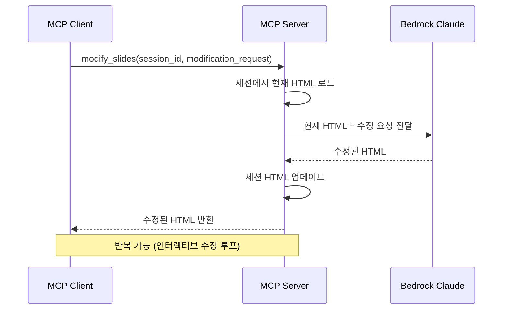

# 5. 슬라이드 수정 (F4)

Date: 2026-02-11

## Status

Accepted

## Context

F3에서 생성한 HTML 슬라이드를 사용자의 자연어 수정 요청으로 반복 수정할 수 있어야 한다. 디자인 도구를 직접 다루지 않아도, "3번 슬라이드 제목 바꿔줘", "배경색을 파란색으로 바꿔줘" 같은 자연어 요청으로 결과물을 개선하는 인터랙티브 수정 루프를 지원한다.

## Decision

MCP 도구 `modify_slides`를 구현하여, 세션 ID로 현재 HTML을 로드한 뒤 Bedrock LLM에 수정 요청을 전달하고, 수정된 HTML로 세션을 업데이트한다.

### Technical Details

- Bedrock Claude Opus 4.6 호출 (Strands SDK 경유)
- 프롬프트: 현재 HTML 슬라이드 코드 + 사용자의 자연어 수정 요청 → 수정된 HTML 반환
- 지원하는 수정 유형:
  - 텍스트 변경: 제목, 본문 내용, 불릿 포인트 수정/추가/삭제
  - 레이아웃 조정: 요소 위치, 크기, 간격 변경
  - 스타일 변경: 색상, 폰트, 배경 변경
  - 이미지 교체: 새 이미지 아이디어로 Gemini 재생성 후 교체
  - 슬라이드 추가/삭제/순서 변경
  - 발표자 노트 수정
- 세션 상태: F3의 `SlidesService._sessions` dict 활용
- 세션 상태 이력: 수정 이력을 유지하여 이전 상태로 되돌리기 가능 (선택적)
- **data-region 좌표 보호**: 수정 후에도 `_validate_region_styles()`로 `data-region` div의 `position:absolute` 좌표를 `LAYOUT_REGIONS` 원본으로 복원. `_detect_layout_type_from_html()`로 region 이름 집합에서 layout_type을 자동 감지
- **프롬프트 보호 규칙**: `SLIDES_MODIFY_SYSTEM_PROMPT`와 `SLIDES_MODIFY_SINGLE_USER_PROMPT_TEMPLATE`에 "data-region div의 style 속성 변경 금지, 영역 내부 콘텐츠만 수정 가능" 지시 포함

### MCP Tool Interface

| 항목 | 값 |
|------|-----|
| Tool | `modify_slides` |
| 입력 | `session_id: str`, `modification_request: str` (자연어) |
| 출력 | 수정된 HTML 슬라이드 |

### Acceptance Criteria

1. 세션 ID와 수정 요청을 입력하면 수정된 HTML 슬라이드가 반환된다
2. 텍스트 변경, 레이아웃 조정, 스타일 변경이 정확히 반영된다
3. 수정되지 않은 부분은 기존 상태를 유지한다
4. 반복적인 수정 요청이 누적적으로 반영된다

### Out of Scope

- 수정 이력 되돌리기 (Undo) — 향후 Phase 2에서 고려

## Consequences

- 존재하지 않는 세션 ID에 대해 에러 반환이 필요하다
- 모호한 수정 요청은 LLM이 합리적으로 해석하여 반영한다
- 이미지 재생성이 필요한 수정은 Gemini API 추가 호출이 발생한다
- 수정 요청이 전체 구조를 크게 변경하는 경우 LLM이 전체 HTML을 재생성한다

## References

- 구현: `src/ppt_generator/tools/slides/service.py` — `SlidesService.modify()`
- 컨트롤러: `src/ppt_generator/tools/slides/controller.py` — `modify_slides` MCP 도구
- 프롬프트: `src/ppt_generator/interfaces/constants.py` — `SLIDES_MODIFY_SYSTEM_PROMPT`, `SLIDES_MODIFY_USER_PROMPT_TEMPLATE`
- 테스트: `tests/test_slides_service.py` — `TestModify` 클래스
- 좌표 검증: `src/ppt_generator/tools/slides/service.py` — `_validate_region_styles()`, `_detect_layout_type_from_html()`
- 관련 ADR: [0004-html-slide-generation](./0004-html-slide-generation.md), [0012-layout-skeleton-enforcement](./0012-layout-skeleton-enforcement.md)
- ALPS: Section 7.4
