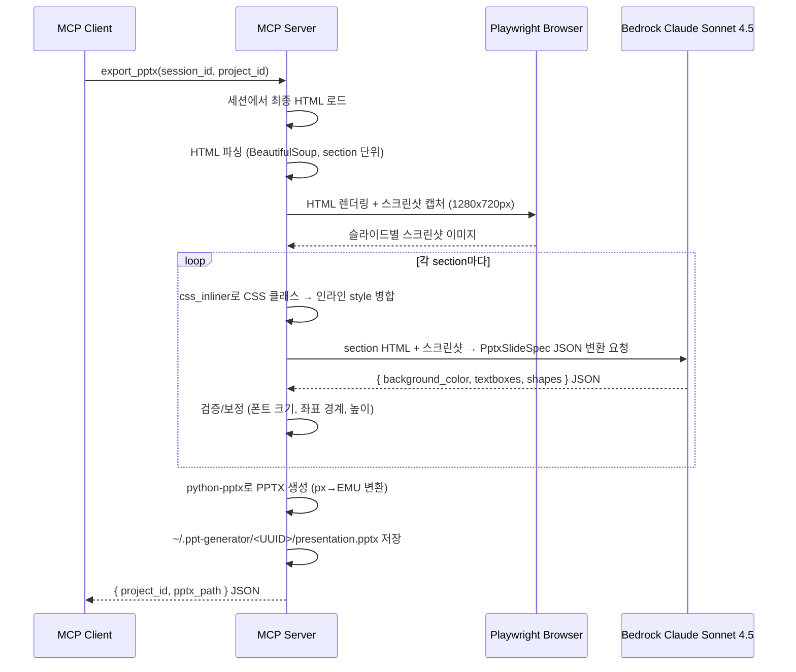

# 6. PPTX 내보내기 (F5)

Date: 2026-02-11

## Status

Accepted (Updated: data-region 기반 요소 추출 추가 → LLM 기반 HTML→PPTX 변환 + Playwright 스크린샷)

## Context

F3/F4를 거쳐 확정된 HTML 슬라이드를 편집 가능한 .pptx 파일로 변환해야 한다. HTML 기반 슬라이드는 디자인 자유도가 높지만, 최종 결과물은 PowerPoint에서 텍스트/이미지/도형을 개별적으로 편집할 수 있어야 실무에서 활용 가능하다.

## Decision

MCP 도구 `export_pptx`를 구현하여, 세션의 최종 HTML을 파싱하고 python-pptx로 변환한다. LLM(Claude Sonnet 4.5)이 각 `<section>` HTML을 분석하여 PPTX 요소(텍스트박스, 도형)의 좌표/크기/서식을 JSON으로 변환하고, python-pptx로 렌더링한다. Playwright로 HTML 스크린샷을 캡처하여 LLM에 시각적 참조로 제공한다.

### Technical Details

- HTML 파싱: BeautifulSoup으로 HTML 슬라이드 DOM 파싱 (`<section>` 단위)
- **LLM 기반 변환**: Claude Sonnet 4.5 (8K max tokens)가 `<section>` HTML을 분석하여 `PptxSlideSpec` JSON으로 변환
- **Playwright 스크린샷**: HTML을 브라우저에서 렌더링한 1280x720px 스크린샷을 LLM에 시각적 참조로 제공
- 좌표 변환: HTML 1280x720px → PPTX 13.333x7.5인치 EMU 좌표로 변환
  - 변환 비율: `EXPORT_PX_TO_INCHES_X = 13.333/1280`, `EXPORT_PX_TO_INCHES_Y = 7.5/720`
- **CSS 인라이닝**: `css_inliner.py`로 TailwindCSS 클래스를 인라인 style로 병합 후 LLM에 전달
- 폰트: 맑은 고딕 (한글 호환)
- 발표자 노트: 각 슬라이드의 `data-speaker-notes` 속성에서 추출하여 PPTX notes 영역에 삽입
- 출력: `~/.ppt-generator/<UUID>/presentation.pptx`
- **검증/보정**: LLM 출력의 폰트 크기(10~44pt 범위 클램핑), 좌표 경계(1280x720 범위), 텍스트박스 높이 등을 후처리로 검증

### python-pptx 객체 매핑

| HTML 요소 | PPTX 객체 |
|-----------|-----------|
| `
`, `
`, `<h1>`~`<h6>` | `slide.shapes.add_textbox()` (폰트 스타일 반영) |
| `` | `slide.shapes.add_picture()` (alt-text 포함) |
| 배경색/이미지 | `slide.background` 설정 |
| 도형 | `slide.shapes.add_shape()` (사각형, 원 등) |
| `data-speaker-notes` | PPTX 발표자 노트 |

### data-region 기반 요소 추출 (신규)

`data-wrapper="true"` div가 있는 section은 region 기반 로직으로 처리하고, 없으면 레거시 로직으로 폴백한다.

**Region 기반 처리 흐름:**
1. `data-wrapper` div에서 인라인 `background-color` 추출 → 슬라이드 배경 설정
2. `data-region` div를 순회하며, 각 region의 `position:absolute` style에서 좌표 추출
3. region 내부에 ``가 있으면 `_add_picture()` (region 좌표 사용)
4. 텍스트만 있으면 `_add_textbox_at()` (region 좌표 사용, title/subtitle은 bold)

**장점:** LLM이 TailwindCSS로 자유 배치하더라도, `data-region` div의 `position:absolute` 좌표가 LAYOUT_REGIONS 원본으로 보장되므로 PPTX에서 정확한 위치에 요소가 배치된다.

### MCP Tool Interface

| 항목 | 값 |
|------|-----|
| Tool | `export_pptx` |
| 입력 | `session_id: str`, `project_id: str` (선택) |
| 출력 | `project_id`와 `.pptx` 파일 경로를 포함하는 JSON |

### Acceptance Criteria

1. 세션 ID를 입력하면 .pptx 파일이 생성된다
2. HTML 슬라이드의 텍스트, 이미지, 도형이 PPTX에서 개별 객체로 분리되어 편집 가능하다
3. 요소의 위치와 크기가 HTML 슬라이드와 유사하게 재현된다
4. PowerPoint/한쇼에서 레이아웃 및 폰트 깨짐 없이 열린다
5. 발표자 노트에 스크립트가 포함되어 있다
6. 이미지에 대체 텍스트가 포함되어 있다

### Out of Scope

- 복잡한 CSS (gradient, animation, transform)의 정확한 PPTX 변환
- 편집 가능한 차트 객체 삽입

## Consequences

- HTML에 복잡한 CSS가 포함된 경우 LLM이 근사 변환한다
- LLM 변환 실패 시 region 기반 폴백 로직으로 처리한다
- HTML 구조가 예상 포맷과 다른 경우 최대한 추출 시도, 실패 시 기본 텍스트 슬라이드로 폴백
- 세션이 만료되었거나 존재하지 않는 경우 에러 반환
- Playwright가 설치되지 않은 경우 스크린샷 없이 HTML만으로 LLM 변환 수행
- 의존성: `beautifulsoup4`, `python-pptx`, `playwright` (선택)

## References

- 구현: `src/ppt_generator/tools/pptx/service.py` — `ExportService`
- 컨트롤러: `src/ppt_generator/tools/pptx/controller.py` — `export_pptx` MCP 도구
- 의존: `src/ppt_generator/tools/slides/service.py` — `SlidesService.get_session_html()`
- CSS 인라이너: `src/ppt_generator/tools/slides/css_inliner.py` — `inline_css_classes()`
- 스키마: `src/ppt_generator/interfaces/schemas.py` — `PptxSlideSpec`, `PptxTextBox`, `PptxShape`, `PptxTextRun`, `PptxParagraph`
- 프롬프트: `src/ppt_generator/interfaces/constants.py` — `PPTX_CONVERT_SYSTEM_PROMPT`, `PPTX_CONVERT_MODEL_ID`
- 테스트: `tests/test_pptx_service.py`
- 관련 ADR: [0004-html-slide-generation](./0004-html-slide-generation.md), [0005-slide-modification](./0005-slide-modification.md), [0012-layout-skeleton-enforcement](./0012-layout-skeleton-enforcement.md)
- ALPS: Section 7.5
