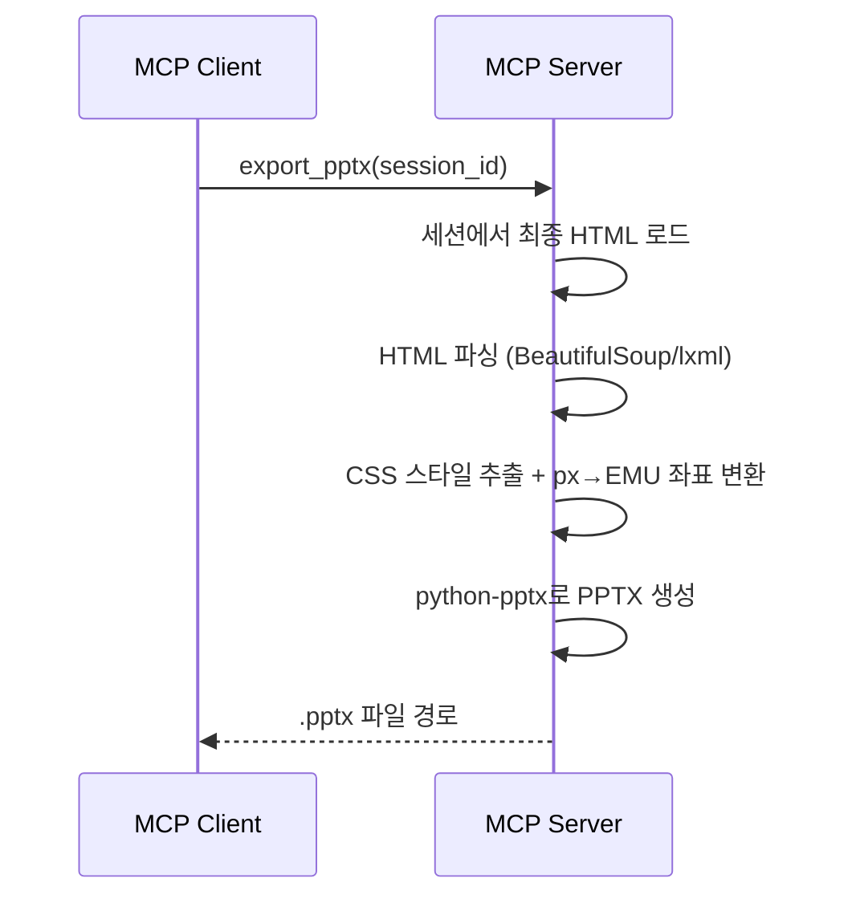

# 6. PPTX 내보내기 (F6)

Date: 2026-02-11

## Status

Accepted

## Context

F4/F5를 거쳐 확정된 HTML 슬라이드를 편집 가능한 .pptx 파일로 변환해야 한다. HTML 기반 슬라이드는 디자인 자유도가 높지만, 최종 결과물은 PowerPoint에서 텍스트/이미지/도형을 개별적으로 편집할 수 있어야 실무에서 활용 가능하다.

## Decision

MCP 도구 `export_pptx`를 구현하여, 세션의 최종 HTML을 파싱하고 python-pptx로 변환한다. HTML 요소를 PPTX 객체로 매핑하고, px 좌표를 EMU 좌표로 변환한다.

### Technical Details

- HTML 파싱: BeautifulSoup 또는 lxml로 HTML 슬라이드 DOM 파싱
- CSS 스타일 추출: 인라인 스타일에서 `position`, `width`, `height`, `color`, `font-size`, `background` 등 추출
- 좌표 변환: HTML px → PPTX EMU(English Metric Units) 좌표로 변환
  - 슬라이드 크기: 13.333 x 7.5인치 (표준 16:9)
  - 변환 비율: HTML 960x540px 기준으로 비례 매핑
- 폰트: 맑은 고딕 (한글 호환)
- 발표자 노트: 각 슬라이드의 notes 영역에 스크립트 삽입
- 출력: 로컬 파일 시스템에 .pptx 저장

### python-pptx 객체 매핑

| HTML 요소 | PPTX 객체 |
|-----------|-----------|
| `
`, `
`, `<h1>`~`<h6>` | `slide.shapes.add_textbox()` (폰트 스타일 반영) |
| `` | `slide.shapes.add_picture()` (alt-text 포함) |
| 배경색/이미지 | `slide.background` 설정 |
| 도형 | `slide.shapes.add_shape()` (사각형, 원 등) |
| `data-speaker-notes` | PPTX 발표자 노트 |

### MCP Tool Interface

| 항목 | 값 |
|------|-----|
| Tool | `export_pptx` |
| 입력 | `session_id: str` |
| 출력 | `.pptx` 파일 경로 |

### Acceptance Criteria

1. 세션 ID를 입력하면 .pptx 파일이 생성된다
2. HTML 슬라이드의 텍스트, 이미지, 도형이 PPTX에서 개별 객체로 분리되어 편집 가능하다
3. 요소의 위치와 크기가 HTML 슬라이드와 유사하게 재현된다
4. PowerPoint/한쇼에서 레이아웃 및 폰트 깨짐 없이 열린다
5. 발표자 노트에 스크립트가 포함되어 있다
6. 이미지에 대체 텍스트가 포함되어 있다

### Out of Scope

- 복잡한 CSS (gradient, animation, transform)의 정확한 PPTX 변환
- 편집 가능한 차트 객체 삽입

## Consequences

- HTML에 복잡한 CSS가 포함된 경우 PPTX에서 지원되는 범위로 근사 변환된다
- 이미지 base64 디코딩 실패 시 해당 이미지를 건너뛰고 텍스트만 배치한다
- HTML 구조가 예상 포맷과 다른 경우 최대한 추출 시도, 실패 시 기본 텍스트 슬라이드로 폴백
- 세션이 만료되었거나 존재하지 않는 경우 에러 반환
- `beautifulsoup4` 또는 `lxml`이 신규 의존성으로 추가된다

## References

- 구현: `src/ppt_generator/tools/pptx/service.py` — `ExportService`
- 컨트롤러: `src/ppt_generator/tools/pptx/controller.py` — `export_pptx` MCP 도구
- 의존: `src/ppt_generator/tools/slides/service.py` — `SlidesService.get_session_html()`
- 테스트: `tests/test_pptx_service.py`
- 관련 ADR: [0004-html-slide-generation](./0004-html-slide-generation.md), [0005-slide-modification](./0005-slide-modification.md)
- ALPS: Section 7.6
