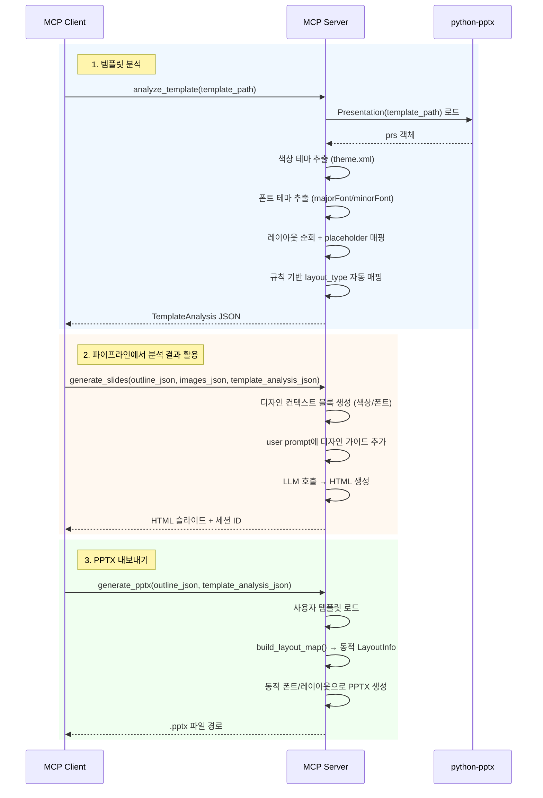

# 8. PPTX 템플릿 분석 및 동적 디자인 반영 (F8)

Date: 2026-02-11

## Status

Proposed

> **Note (2026-02-11)**: AWS 기본 템플릿에 대해서는 정적 추출을 먼저 적용하였다.
> `scripts/extract_layout_positions.py`로 placeholder 위치를 추출하여 `template/layout.json`에 저장하고,
> `constants.py`의 `_load_layout_regions()`로 `LAYOUT_REGIONS` 딕셔너리에 로드하여 `build_layout_skeleton()`에서 사용.
> 또한 `scripts/extract_layout_json.py`로 전체 97종 레이아웃 정보를 JSON으로 추출함.
> 동적 `analyze_template` 도구 구현은 추후 진행 예정.

## Context

현재 시스템은 AWS 전용 PPTX 템플릿에 하드코딩으로 종속되어 있다:

- `layout_mapping.py` — AWS 템플릿 전용 레이아웃 인덱스 고정 (`title=0`, `text_image=28`, `closing=87` 등)
- `constants.py` — 폰트(`맑은 고딕`, `Pretendard`), 디자인 가이드가 하드코딩
- `pptx/service.py` — DI 컨테이너에서 고정된 AWS 템플릿 경로 사용
- `slides/service.py` — `SLIDES_SYSTEM_PROMPT`에 디자인 가이드(색상, 폰트, 레이아웃) 고정

사용자가 자신의 PPTX 템플릿을 제공하면 해당 템플릿의 디자인(색상 테마, 폰트 테마, 레이아웃 구성)을 자동 분석하여 HTML 슬라이드 생성과 PPTX 내보내기에 동적으로 반영할 수 있어야 한다. 이를 통해 기업별 브랜드 가이드라인을 준수하는 프레젠테이션을 생성할 수 있다.

## Decision

새로운 MCP 도구 `analyze_template`을 구현하여 python-pptx로 PPTX 파일을 분석하고, 규칙 기반으로 레이아웃을 자동 매핑한다. 분석 결과는 구조화된 JSON(`TemplateAnalysis`)으로 반환하며, 이를 기존 파이프라인(F3 HTML 슬라이드, F5 PPTX 내보내기)에 동적으로 주입한다.

### Technical Details

#### 1. 새 MCP 도구: `analyze_template`

`tools/template/` 디렉토리에 controller.py + service.py를 구현한다.

**분석 대상:**
- **색상 테마**: python-pptx의 `presentation.slide_masters[0].slide_layouts` 및 `theme.xml`에서 accent1~accent6, dk1/dk2, lt1/lt2 색상 추출
- **폰트 테마**: `theme.xml`의 `majorFont`/`minorFont`에서 한글(ea)/라틴(latin) 폰트명 추출
- **레이아웃 목록**: 모든 `slide_layouts`를 순회하며 각 레이아웃의 이름, placeholder 타입/인덱스/크기 매핑
- **규칙 기반 레이아웃 자동 매핑**: placeholder 타입/이름 패턴 분석으로 `layout_type` 결정

**규칙 기반 레이아웃 매핑 로직:**

| 조건 | layout_type |
|------|-------------|
| placeholder에 `TITLE`과 `SUBTITLE`만 존재 | `title` |
| placeholder에 `TITLE` + `BODY` + `PICTURE` 존재 | `text_image` |
| placeholder에 `TITLE` + `BODY`만 존재 (PICTURE 없음) | `text_only` |
| 레이아웃 이름에 `chart`, `diagram`, `data` 포함 | `chart` |
| 레이아웃 이름에 `thank`, `closing`, `end` 포함 | `closing` |
| placeholder가 0개 (빈 레이아웃) | `freeform` |

매핑 실패 시 `null`을 반환하여, 호출자가 폴백 여부를 결정할 수 있게 한다.

#### 2. 데이터 스키마

`schemas.py`에 다음 데이터 클래스를 추가한다:

```python
@dataclass(frozen=True)
class ColorTheme:
    dk1: str       # dark 1 (ex: "#000000")
    dk2: str       # dark 2
    lt1: str       # light 1 (ex: "#FFFFFF")
    lt2: str       # light 2
    accent1: str   # 주요 강조색
    accent2: str
    accent3: str
    accent4: str
    accent5: str
    accent6: str

@dataclass(frozen=True)
class FontTheme:
    major_latin: str   # 제목용 라틴 폰트 (ex: "Calibri")
    major_ea: str      # 제목용 동아시아 폰트 (ex: "맑은 고딕")
    minor_latin: str   # 본문용 라틴 폰트
    minor_ea: str      # 본문용 동아시아 폰트

@dataclass(frozen=True)
class PlaceholderInfo:
    idx: int           # placeholder 인덱스
    type: str          # "TITLE", "SUBTITLE", "BODY", "PICTURE", "OBJECT" 등
    left: float        # 위치 (인치)
    top: float
    width: float
    height: float

@dataclass(frozen=True)
class LayoutAnalysis:
    index: int                         # 슬라이드 레이아웃 인덱스
    name: str                          # 레이아웃 이름
    placeholders: list[PlaceholderInfo]
    mapped_type: str | None            # 자동 매핑된 layout_type (매핑 실패 시 None)

@dataclass(frozen=True)
class TemplateAnalysis:
    color_theme: ColorTheme
    font_theme: FontTheme
    layouts: list[LayoutAnalysis]
    layout_type_map: dict[str, int]    # layout_type → layout_index 매핑

@dataclass(frozen=True)
class TemplateAnalysisRequest:
    template_path: str

@dataclass(frozen=True)
class TemplateAnalysisResponse:
    analysis_json: str  # TemplateAnalysis를 JSON 직렬화한 문자열
```

#### 3. 동적 레이아웃 매핑

분석된 레이아웃 정보로 `LayoutInfo` 객체를 동적으로 생성한다:

- `TemplateAnalysis.layout_type_map`의 각 엔트리 → `LayoutInfo` 변환
- `PlaceholderInfo`의 `type` 필드로 `title_ph`, `body_ph`, `picture_ph` 등 자동 설정
- `LAYOUT_MAP`(기존 AWS 하드코딩)은 `template_analysis`가 없을 때의 기본 폴백으로 유지

```python
def build_layout_map(analysis: TemplateAnalysis) -> dict[str, LayoutInfo]:
    """TemplateAnalysis에서 동적 LayoutInfo 맵을 생성한다."""
    result = {}
    for layout in analysis.layouts:
        if layout.mapped_type is None:
            continue
        title_ph = next((p.idx for p in layout.placeholders if p.type == "TITLE"), None)
        subtitle_ph = next((p.idx for p in layout.placeholders if p.type == "SUBTITLE"), None)
        body_ph = next((p.idx for p in layout.placeholders if p.type == "BODY"), None)
        picture_ph = next((p.idx for p in layout.placeholders if p.type == "PICTURE"), None)
        result[layout.mapped_type] = LayoutInfo(
            layout_index=layout.index,
            layout_name=layout.name,
            title_ph=title_ph,
            subtitle_ph=subtitle_ph,
            body_ph=body_ph,
            picture_ph=picture_ph,
        )
    return result
```

#### 4. HTML 슬라이드 디자인 반영

`SLIDES_SYSTEM_PROMPT`(시스템 프롬프트)는 변경하지 않는다. 대신 user prompt에 디자인 컨텍스트 블록을 동적으로 추가한다.

`constants.py`에 템플릿 상수를 추가한다:

```python
SLIDES_DESIGN_CONTEXT_TEMPLATE = """
## 템플릿 디자인 가이드

이 프레젠테이션은 사용자 제공 템플릿의 디자인을 따릅니다.

### 색상 팔레트
- 주요 강조색: {accent1}
- 보조 강조색: {accent2}, {accent3}
- 텍스트 색상: 어두운 배경에는 {lt1}, 밝은 배경에는 {dk1}
- 배경 후보: {lt2}, {dk2}

### 폰트
- 제목: '{major_font}'
- 본문: '{minor_font}'

### 사용 지침
- 위 색상 팔레트와 폰트를 일관되게 적용하세요
- accent1을 핵심 강조 요소(제목 배경, CTA 버튼 등)에 사용하세요
- 본문 텍스트에는 지정된 텍스트 색상을 사용하세요
"""
```

`slides/service.py`의 `generate()` 메서드에서 `TemplateAnalysis`가 존재하면 위 템플릿을 포맷팅하여 user prompt에 추가한다.

#### 5. PPTX 생성 확장

`generate_pptx` 도구에 선택적 파라미터 `template_analysis_json: str | None`을 추가한다:

- `template_analysis_json`이 제공되면:
  - 사용자 지정 템플릿 파일을 `Presentation(template_path)`로 로드
  - `build_layout_map()`으로 동적 레이아웃 매핑 사용
  - `FontTheme`에서 추출한 폰트명 적용
- `template_analysis_json`이 없으면:
  - 기존 AWS 템플릿 + `LAYOUT_MAP` 사용 (하위 호환)

### Alternatives Considered

#### LLM 기반 매핑 (탈락)
- 레이아웃 정보를 LLM에 전달하여 `layout_type` 매핑을 요청
- **단점**: 비결정적(같은 입력에 다른 결과), API 호출 비용 발생, 지연 시간 증가
- 규칙 기반으로 충분히 해결 가능한 문제에 LLM을 사용하는 것은 과도

#### 사용자 수동 매핑 (탈락)
- 사용자가 레이아웃 인덱스와 `layout_type`을 직접 지정
- **단점**: UX 저하 (사용자가 PPTX 내부 구조를 알아야 함), 템플릿 변경 시 재설정 필요
- MCP 도구 사용자(LLM 클라이언트)에게 부담 전가

#### 규칙 기반 자동 매핑 (채택)
- placeholder 타입/이름 패턴으로 자동 분류
- **장점**: 결정적 결과, 추가 비용 없음, 빠른 실행, 폴백 가능
- **한계**: 비표준 레이아웃은 매핑 실패 가능 → `mapped_type: null`로 명시적 처리

### MCP Tool Interface

| 항목 | 값 |
|------|-----|
| Tool | `analyze_template` |
| 입력 | `template_path: str` (PPTX 파일 경로) |
| 출력 | `TemplateAnalysis` JSON 문자열 |

### 기존 도구 변경

| 도구 | 변경 사항 |
|------|-----------|
| `generate_slides` | 선택적 `template_analysis_json` 파라미터 추가 |
| `generate_pptx` | 선택적 `template_analysis_json` 파라미터 추가 |

### Acceptance Criteria

1. PPTX 템플릿 파일 경로를 입력하면 `TemplateAnalysis` JSON이 반환된다
2. 색상 테마(accent1~6, dk1/dk2, lt1/lt2)가 정확히 추출된다
3. 폰트 테마(major/minor × latin/ea)가 정확히 추출된다
4. 레이아웃 목록과 각 레이아웃의 placeholder 정보가 포함된다
5. 규칙 기반 매핑으로 `title`, `text_image`, `text_only`, `closing`, `freeform` 중 적절한 타입이 할당된다
6. 매핑되지 않는 레이아웃은 `mapped_type: null`로 반환된다
7. `template_analysis_json` 없이 호출하면 기존 동작과 동일하다 (하위 호환)
8. `generate_slides`에 `template_analysis_json`을 전달하면 해당 디자인이 HTML에 반영된다
9. `generate_pptx`에 `template_analysis_json`을 전달하면 사용자 템플릿 기반으로 PPTX가 생성된다

### Out of Scope

- 슬라이드 마스터 이미지/배경 패턴의 HTML 재현
- 테마 색상 외 개별 슬라이드의 커스텀 색상 분석
- 여러 슬라이드 마스터가 있는 템플릿의 마스터별 분석
- 매크로/VBA가 포함된 .pptm 파일 지원
- 분석 결과의 사용자 수동 보정 UI



## Consequences

- 사용자가 기업 브랜드 템플릿을 제공하면 해당 디자인이 자동으로 반영된다
- 기존 AWS 템플릿 기반 워크플로우는 변경 없이 유지된다 (하위 호환)
- 규칙 기반 매핑이 실패하는 비표준 레이아웃은 `mapped_type: null`로 표시되며, 기존 `LAYOUT_MAP` 폴백이 사용된다
- `theme.xml`에 색상/폰트가 정의되지 않은 템플릿은 기본값(Office 기본 테마)으로 폴백한다
- python-pptx의 `oxml` 레이어에 접근하여 테마를 파싱하므로, python-pptx 내부 API 변경에 영향을 받을 수 있다
- 신규 의존성 추가 없음 (python-pptx 기존 의존성 활용)

## References

- 구현 대상: `src/ppt_generator/tools/template/` (controller.py, service.py — 신규)
- 스키마 확장: `src/ppt_generator/interfaces/schemas.py` — `TemplateAnalysis` 등
- 상수 추가: `src/ppt_generator/interfaces/constants.py` — `SLIDES_DESIGN_CONTEXT_TEMPLATE`
- 레이아웃 매핑: `src/ppt_generator/templates/layout_mapping.py` — `build_layout_map()` 추가
- 관련 ADR: [0004-html-slide-generation](./0004-html-slide-generation.md), [0006-pptx-export](./0006-pptx-export.md)
- ALPS: Section 7 (파이프라인)
