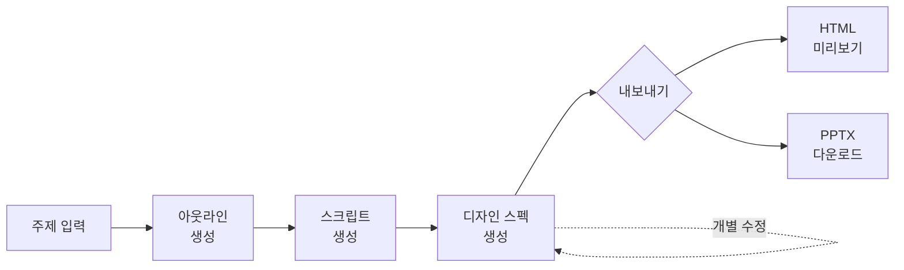
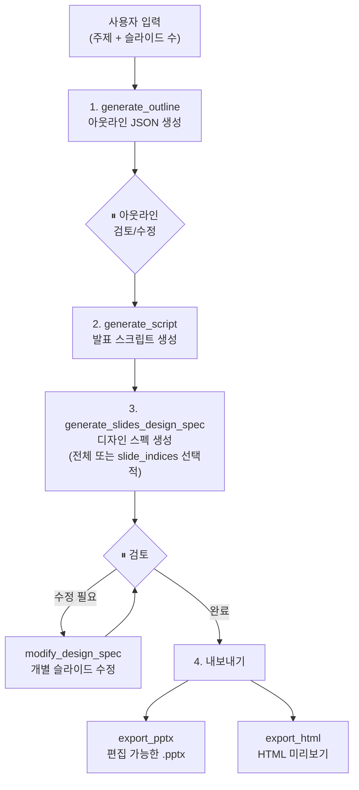

# Architecture

## 주요 기능

- **아웃라인 생성** — 주제와 슬라이드 수를 입력하면 구조화된 아웃라인 JSON을 생성
- **발표 스크립트 생성** — 아웃라인 기반으로 슬라이드별 발표 스크립트(speaker notes) 작성
- **디자인 스펙 생성** — 슬라이드별 정밀한 레이아웃을 PptxSlideSpec JSON으로 설계
- **슬라이드별 수정** — 개별 슬라이드의 디자인 스펙을 추가/수정/삭제 (전체 재생성 불필요)
- **HTML 미리보기** — 디자인 스펙에서 결정론적으로 HTML 변환
- **PPTX 내보내기** — 디자인 스펙에서 편집 가능한 PPTX로 결정론적 변환
- **프로젝트 관리** — `project_id` 기반으로 중간 결과물 저장/로드, 중간 단계부터 재개 가능

## 생성 파이프라인



## 사용 워크플로우



- 모든 도구는 `project_id`를 자동 생성하여 `~/.ppt-generator/<UUID>/`에 결과물을 저장합니다
- `load_*` 도구에 `project_id`를 전달하면 중간 단계부터 재개할 수 있습니다
- 첫 슬라이드 생성 시 디자인 테마를 추출하여 후속 슬라이드의 시각적 일관성을 유지합니다

## MCP 도구

### 생성 도구

| 도구                         | 설명                                                      |
| ---------------------------- | --------------------------------------------------------- |
| `generate_outline`           | 주제와 슬라이드 수를 기반으로 아웃라인 JSON 생성          |
| `generate_script`            | 아웃라인 기반 슬라이드별 발표 스크립트 생성               |
| `generate_slides_design_spec` | 슬라이드 디자인 스펙 생성 (전체 또는 선택적, 서버 내부 병렬 처리) |
| `modify_design_spec`         | 디자인 스펙의 개별 슬라이드 추가/수정/삭제                |
| `export_html`                | 디자인 스펙에서 HTML 슬라이드 내보내기 (결정론적 변환)    |
| `export_pptx`                | 디자인 스펙에서 편집 가능한 PPTX 내보내기 (결정론적 변환) |

#### 디자인 스펙 병렬 생성

`generate_slides_design_spec`은 슬라이드별 독립 LLM 호출을 `ThreadPoolExecutor`로 병렬 처리합니다.

- **병렬 워커 수**: `DESIGN_SPEC_PARALLEL` 환경변수로 제어 (기본 `8`). API rate limit에 맞게 조절 가능
- **Longest-job-first 스케줄링**: 슬라이드 복잡도 점수(1~13)를 산출하여 복잡한 슬라이드부터 먼저 처리 → wall-clock time 단축
- **Adaptive thinking effort**: 복잡도에 따라 `high`(7~13) / `medium`(4~6) / `low`(1~3) effort를 동적 적용 → 단순 슬라이드 토큰 절약, 복잡한 슬라이드 품질 유지

### 프로젝트 관리 도구

| 도구                  | 설명                             |
| --------------------- | -------------------------------- |
| `list_projects`       | 기존 프로젝트 목록 조회          |
| `load_project_status` | 프로젝트 상태 및 메타데이터 로드 |
| `load_outline`        | 저장된 아웃라인 JSON 로드        |
| `load_script`         | 저장된 스크립트 JSON 로드        |
| `load_design_spec`    | 저장된 디자인 스펙 로드          |

## 사용 모델

디자인 스펙과 아웃라인 생성에는 Claude Extended Thinking을 사용합니다. 모든 LLM 호출은 Sonnet 4.6을 사용합니다.

| 용도              | Bedrock 모델 ID                          | Anthropic 모델 ID   | Max Tokens | Thinking Effort                          |
| ----------------- | ---------------------------------------- | -------------------- | ---------- | ---------------------------------------- |
| 디자인 스펙 생성  | `global.anthropic.claude-sonnet-4-6`     | `claude-sonnet-4-6` | 64,000     | adaptive (슬라이드 복잡도 기반 high/medium/low) |
| 아웃라인          | `global.anthropic.claude-sonnet-4-6`     | `claude-sonnet-4-6` | 32,000     | medium                                           |
| 스크립트          | `global.anthropic.claude-sonnet-4-6`     | `claude-sonnet-4-6` | 32,000     | off                                              |

## 프로젝트 구조

```
ppt-generator/
├── src/ppt_generator/
│   ├── server.py                  # MCP 서버 진입점
│   ├── di/
│   │   └── container.py           # 의존성 주입 컨테이너
│   ├── interfaces/
│   │   ├── constants.py           # 모델 설정, 수치 상수
│   │   ├── schemas.py             # 내부 도메인 모델 (dataclass)
│   │   ├── llm_output_models.py   # LLM structured_output용 Pydantic 모델
│   │   └── prompts/               # 프롬프트 템플릿 (.prompt.md)
│   ├── templates/
│   │   ├── slide.html             # 개별 슬라이드 HTML 템플릿
│   │   ├── slides_container.html  # iframe 컨테이너 템플릿
│   │   └── layout_mapping.py      # layout_index → 슬라이드 레이아웃 매핑
│   └── tools/
│       ├── outline/               # 아웃라인 생성
│       ├── script/                # 발표 스크립트 생성
│       ├── design/                # 디자인 스펙 생성/수정
│       ├── slides/                # HTML 슬라이드 생성
│       ├── pptx/                  # PPTX 내보내기
│       └── project/               # 프로젝트 관리
├── env/
│   └── local.env                  # 샘플 환경변수 파일
├── docs/
│   ├── adr/                       # Architecture Decision Records
│   └── ppt-generator.alps.md     # ALPS 설계 문서
├── tests/
└── pyproject.toml
```

## 기술 스택

| 구성 요소               | 기술                               |
| ----------------------- | ---------------------------------- |
| 프로토콜                | Model Context Protocol (MCP)       |
| 언어                    | Python 3.13+                       |
| 패키지 관리             | uv + hatchling                     |
| 에이전트 프레임워크     | AWS Strands SDK (`strands-agents`) |
| LLM                     | Claude Sonnet 4.6 Extended Thinking |
| 슬라이드 프레임워크     | 순수 HTML/CSS (인라인 스타일)      |
| PPTX 내보내기           | python-pptx                        |
