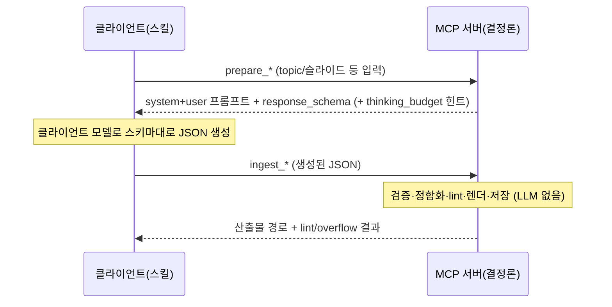
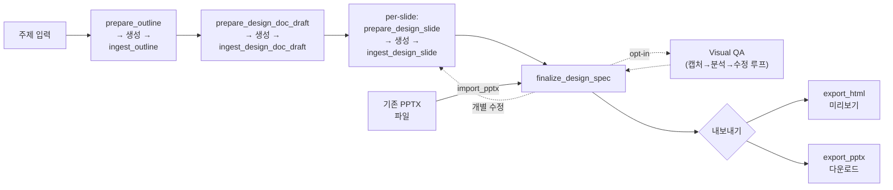
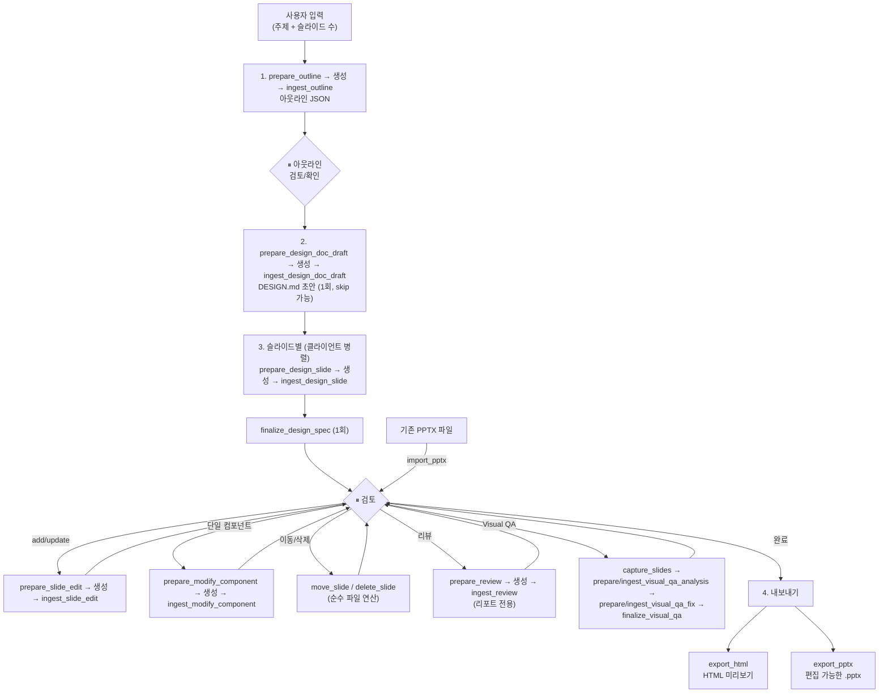

# Architecture

이 서버는 **LLM 을 직접 호출하지 않습니다.** 각 생성 단계는 `prepare_*`(프롬프트 + 출력 스키마 반환)와 `ingest_*`(검증 + 후처리 + 저장)로 분리되어 있으며, 그 사이의 **토큰 생성만 클라이언트(Claude Code 등)가 수행**합니다. 서버는 프롬프트·출력 스키마·결정론적 후처리(Pydantic 검증, 계층 정합화, lint, HTML/PPTX 렌더)를 소유하는 **결정론적 서버**입니다. 설계 배경은 [offload/0001](../adr/offload/0001-client-llm-offload-plugin.md)을 참조하세요.

## 주요 기능

- **아웃라인 생성** — 주제와 슬라이드 수 입력 → 서버가 프롬프트+스키마를 반환하고, 클라이언트가 구조화된 아웃라인 JSON 을 생성
- **DESIGN.md 초안** — 덱 전체의 디자인 의도(theme + tone + page_requests)를 한 번 생성하여 모든 슬라이드가 하나의 테마·서사를 공유
- **디자인 스펙 생성** — 슬라이드별 정밀한 레이아웃을 PptxSlideSpec JSON 으로 설계 (슬라이드 단위 stateless, 클라이언트가 병렬화)
- **슬라이드별 수정** — 개별 슬라이드의 디자인 스펙을 추가/수정/삭제 (전체 재생성 불필요), 단일 컴포넌트 부분 수정
- **Visual QA** — Playwright 스크린샷(서버) + 비전 분석·수정(클라이언트)으로 시각적 결함 자동 감지 및 수정 (opt-in)
- **HTML 미리보기** — 디자인 스펙에서 결정론적으로 HTML 변환
- **PPTX 내보내기** — 디자인 스펙에서 편집 가능한 PPTX 로 결정론적 변환
- **PPTX 임포트** — 기존 PPTX 파일을 디자인 스펙으로 역변환하여 편집·미리보기 (LLM 호출 없이 결정론적 파싱)
- **프로젝트 관리** — `project_id` 기반으로 중간 결과물 저장/로드, 중간 단계부터 재개 가능

## prepare / ingest 핸드셰이크

생성이 필요한 각 도구는 두 개로 쪼개집니다.

- **`prepare_*`** — 서버가 system prompt + user prompt 를, 출력 스키마(`response_schema`)와 함께 반환합니다. LLM 호출 없음(프로젝트 시드 고정 등 결정론적 준비는 허용). 디자인 슬라이드의 경우 `thinking_budget` 을 **힌트**로 함께 반환하지만, 실제 thinking 사용 여부·크기는 클라이언트가 결정합니다.
- **`ingest_*`** — 클라이언트가 스키마대로 생성해 돌려준 JSON 을 받아, 검증·후처리·저장·렌더·lint 를 수행합니다. LLM 호출 없음.

프롬프트 텍스트와 스키마는 서버 안에 그대로 남으므로 프롬프트 엔지니어링의 소유권이 서버에 유지됩니다. 클라이언트는 "무엇을 어떤 형식으로 생성할지"를 서버에서 받아 그대로 따릅니다.



## 생성 파이프라인



## 사용 워크플로우



- 모든 도구는 `project_id`를 자동 생성하여 `~/.ppt-generator/<UUID>/`에 결과물을 저장합니다
- `load_*` 도구에 `project_id`를 전달하면 중간 단계부터 재개할 수 있습니다
- `prepare_design_doc_draft`/`ingest_design_doc_draft`를 **먼저 1회** 호출하여 DESIGN.md(테마·톤·서사)를 확정하면, 이후 모든 슬라이드가 하나의 테마를 공유합니다

## 병렬성은 클라이언트 책임

디자인 스펙 생성은 슬라이드별로 독립적입니다. 서버는 슬라이드 인덱스별로 **stateless** 하므로, 여러 슬라이드를 동시에 진행하는 것은 **클라이언트(스킬)가 여러 `prepare_design_slide` → 생성 → `ingest_design_slide` 체인을 병렬로 돌려** 담당합니다. 서버는 슬라이드 인덱스별 독립 파일 IO 만 하므로 동시 ingest 가 안전하며, 프로젝트 메타데이터(`project.json`)의 read-modify-write 만 `ProjectService._metadata_lock` 으로 보호합니다.

Visual QA 의 iteration 루프(캡처→분석→수정→재캡처)도 클라이언트가 오케스트레이션합니다. `VISUAL_QA_PARALLEL` / `VISUAL_QA_MAX_ITERATIONS` 는 서버측 스크린샷 캡처 병렬도·반복 상한 힌트로만 쓰입니다.

## Controller-Service 패턴

Controller-Service 패턴 + 의존성 주입(DI)을 사용합니다:

- **Controller** (`controller.py`): MCP 도구 인터페이스. `register_*_tools(mcp, service, project_service)` 함수로 도구를 등록하며, 내부에 `@mcp.tool()` 데코레이터가 적용된 함수를 정의합니다. docstring 이 MCP 클라이언트에 도구 설명으로 노출됩니다.
- **Service** (`service.py`): 비즈니스 로직. 프롬프트 조립(`prepare`), 출력 후처리(`ingest`), 파일 IO 만 담당합니다. LLM 을 부르지 않습니다.
- **DIContainer** (`di/container.py`): 결정론적 서비스 인스턴스를 생성/보관합니다. 모델 팩토리·프로바이더 분기 없이, 각 서비스에 대한 지연 초기화(lazy init) 프로퍼티만 제공합니다.

### Key Modules

| 모듈 | 역할 |
|------|------|
| `interfaces/schemas.py` | 내부 도메인 모델 (`@dataclass`) |
| `interfaces/llm_output_models.py` | 클라이언트 출력 검증용 Pydantic 모델, `to_dataclass()`로 변환 |
| `interfaces/constants.py` | 수치 상수, 프롬프트·JSON 스키마 re-export (모델 자격 증명 없음) |
| `interfaces/prompts/*.prompt.md` | 프롬프트 템플릿 (`.prompt.md` 파일 → `__init__.py`에서 로딩) — `prepare_*` 가 반환하는 소스 |
| `interfaces/spec_utils/` | PptxSlideSpec 파싱/검증/직렬화 공유 유틸리티 (패키지: parser, serializer, validator) |
| `interfaces/json_schemas.py` | `prepare_*` 가 반환하는 출력 JSON 스키마 정의 |
| `interfaces/text_measurement.py` | 폰트 메트릭 기반 텍스트 크기 추정 (오버플로우 방지) |
| `templates/layout_mapping.py` | layout_index → 슬라이드 레이아웃 매핑 (97종) |
| `tools/design/service.py` | 디자인 스펙 prepare/ingest — 프롬프트 조립 + 출력 검증·정합화 |
| `tools/visual_qa/service.py` | Visual QA — Playwright 스크린샷 캡처(서버) + 분석/수정 JSON 검증(ingest) |
| `tools/pptx/slide_builder.py` | PptxSlideSpec → python-pptx 변환 |
| `tools/slides/html_renderer.py` | PptxSlideSpec → HTML 변환 |
| `tools/project/service.py` | 프로젝트 디렉토리 IO, 메타데이터, 슬라이드별 파일 관리 |

## Pipeline Design Philosophy: Progressive Refinement

파이프라인은 **추상에서 구체로의 점진적 구체화(Progressive Refinement)** 원칙으로 설계되었습니다.

```
텍스트 (가장 추상적)
  → 아웃라인 (구조화된 JSON — 제목, 내용 요약, 레이아웃 인덱스)
    → DESIGN.md (덱 전체 디자인 의도 — theme, tone, page_requests)
      → 디자인 스펙 (PptxSlideSpec JSON — 클라이언트가 정밀한 레이아웃 설계)
        ├→ HTML 슬라이드 (결정론적 변환, 브라우저 미리보기용)
        └→ PPTX (SlideBuilder 직접 사용, 편집 가능한 포맷으로 변환)
```

> **디자인 스펙 기반 파이프라인**: 디자인 스펙(PptxSlideSpec JSON)을 중간 표현으로 사용하여
> HTML 과 PPTX 를 각각 결정론적으로 생성합니다. 토큰 생성은 클라이언트가 담당하며,
> 서버의 HTML/PPTX 변환·검증·lint 는 모두 결정론적입니다.

**핵심 원칙:**

- **파일 기반 통신**: 모든 도구는 결과를 파일로 저장하고 파일 경로를 반환합니다. `project_id`만으로 도구를 체이닝할 수 있어 인라인 JSON 전달이 불필요하며, MCP 클라이언트의 컨텍스트 윈도우 토큰 사용을 최적화합니다.
- **슬라이드 단위 세분화**: `prepare_slide_edit`/`ingest_slide_edit` 도구로 중간 산출물(디자인 스펙)의 개별 슬라이드를 추가/수정할 수 있어, 전체 재생성 없이 반복적 개선이 가능합니다. 디자인 스펙은 `design_spec/slide_NN.json`, HTML 은 `slides/slide_NN.html` 형식으로 슬라이드별 개별 파일에 저장됩니다.

## MCP 도구

생성이 필요한 도구는 `prepare_*` / `ingest_*` 쌍으로 나뉩니다. `prepare_*` 는 프롬프트 + `response_schema` 를 반환하고, 클라이언트가 그 스키마대로 JSON 을 생성해 `ingest_*` 로 넘깁니다. LLM 이 필요 없는 도구(파일 연산·조회·렌더)는 단일 도구입니다.

### 생성 도구 (prepare/ingest 쌍)

| prepare | ingest | 설명 |
| ------- | ------ | ---- |
| `prepare_outline` | `ingest_outline` | 아웃라인 프롬프트+스키마 반환 → 생성된 아웃라인 JSON 검증·저장 |
| `prepare_design_doc_draft` | `ingest_design_doc_draft` | DESIGN.md 초안(테마·톤·서사) 프롬프트 반환 → 초안 저장 (1회, 이미 있으면 `{"skip": true}`) |
| `prepare_design_slide` | `ingest_design_slide` | 단일 슬라이드 디자인 스펙 프롬프트+스키마+`thinking_budget` 힌트 반환 → 검증·정합화·저장·렌더·lint |
| `prepare_slide_edit` | `ingest_slide_edit` | 읽기 전용 프롬프트+edit_context 반환 → 스펙 검증·원자적 삽입/갱신·렌더 |
| `prepare_modify_component` | `ingest_modify_component` | 단일 컴포넌트 부분 수정 프롬프트 반환 → 정확히 한 요소에 적용·렌더 |
| `prepare_review` | `ingest_review` | 슬라이드 디자인 규칙 리뷰 프롬프트 반환 → 이슈 리포트 (리포트 전용, 자동 재생성 없음) |

- **finalize_design_spec** — 모든 슬라이드 ingest 완료 후 1회 호출. `slides.html` 조립 + 덱 전체 lint 실행 (LLM 없음).
- **ingest_backfill** — imported 슬라이드의 `prepare_modify_component` 가 `stage="backfill"` 을 반환한 경우 design_doc 트리를 backfill 하여 `available_components` 반환. 이후 유효한 component_id 로 `prepare_modify_component` 재호출.

### 파일 연산 도구 (LLM 불필요)

| 도구 | 설명 |
| ---- | ---- |
| `move_slide` | 슬라이드 위치 이동 (1-based). 관련 파일 원자적 재정렬 — LLM 없음 |
| `delete_slide` | 슬라이드 삭제 + 재인덱싱 — LLM 없음 |
| `export_html` | 디자인 스펙 → HTML 슬라이드 내보내기 (결정론적) |
| `export_pptx` | 디자인 스펙 → 편집 가능한 PPTX 내보내기 (결정론적) |
| `import_pptx` | 기존 PPTX 파일 → 디자인 스펙 역변환 (결정론적 파싱, HTML 미리보기 자동 생성) |
| `save_outline_slide` | 아웃라인의 개별 슬라이드 항목 저장/갱신 |

> `move_slide`/`delete_slide` 는 순수 파일 연산이며 어떤 생성도 하지 않습니다. 호출 후 `export_html(project_id=...)` 로 HTML 을 갱신하세요.

### Visual QA 도구

Visual QA 는 opt-in 이며, 스크린샷 캡처만 서버(Playwright)가 하고 비전 분석·수정 생성은 클라이언트가 담당합니다. iteration 루프는 클라이언트가 오케스트레이션합니다.

| 도구 | 역할 |
| ---- | ---- |
| `capture_slides` | Playwright 로 슬라이드 스크린샷 캡처(1280×720, iteration 별 버전 관리). LLM 없음 |
| `prepare_visual_qa_analysis` / `ingest_visual_qa_analysis` | 스크린샷 분석 프롬프트+`images` 반환 → 분석 JSON 검증, 이슈 리포트 (수정 미적용) |
| `prepare_visual_qa_fix` / `ingest_visual_qa_fix` | 수정 프롬프트 반환 → 교정된 전체 스펙 검증·저장·HTML 재렌더 |
| `finalize_visual_qa` | 모든 수정 iteration 후 1회 호출. 덱 컨테이너 HTML + 전체 export 재구성. LLM 없음 |

**감지 이슈 타입**: `word_break` · `text_truncation` · `overlap` · `overflow` · `contrast` · `misalignment` · `wrong_vertical_alignment` · `inconsistent_font_size` · `inconsistent_spacing` · `arrow_disconnected`

> Playwright 미설치 시 기존 기능에 영향 없습니다. 설치: `uv sync` 후 `uv run playwright install chromium`

### 프로젝트 관리 도구

| 도구 | 설명 |
| ---- | ---- |
| `list_projects` | 기존 프로젝트 목록 조회 |
| `load_project_status` | 프로젝트 상태 및 메타데이터 로드 |
| `load_outline` | 저장된 아웃라인 JSON 로드 |
| `load_design_spec` | 저장된 디자인 스펙 로드 |

## PPTX 임포트

`import_pptx` 는 기존 PPTX 파일을 python-pptx 오브젝트 모델 기반으로 결정론적 파싱하여 DesignSpec 으로 변환합니다. LLM 호출 없이 순수 파싱 로직으로 동작하므로 추가 비용이 없습니다.

- **지원 요소**: 텍스트박스, 도형(22종), 커넥터/선, 이미지, 배경, 발표자 노트
- **도형 22종**: Basic(3) + Arrows(5) + Polygons(7) + Stars(3) + Flowchart(3) + Line(1)
- **Graceful degradation**: 그룹 도형 → 평탄화, 테이블 → 도형 격자, 차트 → 경고, 비디오/오디오 → 무시
- **슬라이드 크기 정규화**: 외부 PPTX 의 크기가 1280×720px 이 아닌 경우 비례 스케일링
- imported 프로젝트는 아웃라인이 없습니다. 슬라이드를 add/update 할 때 `prepare_slide_edit` 에 `title`/`content_summary` 를 인라인으로 전달하세요.
- 임포트 후 `prepare_slide_edit`, Visual QA, `export_html`, `export_pptx` 모두 즉시 사용 가능

> 상세 설계: [import/0001](../adr/import/0001-pptx-import-to-design-spec.md)

## 새 도구 추가 패턴

1. `tools/` 하위에 새 디렉토리 생성 (`__init__.py`, `controller.py`, `service.py`)
2. `service.py`: 프롬프트 조립(`prepare`) + 출력 검증·후처리(`ingest`) 메서드를 갖는 클래스 작성. LLM 을 부르지 않음
3. `controller.py`: `register_*_tools(mcp: FastMCP, service: XxxService, project_service: ProjectService)` 함수 작성. 생성이 필요하면 `prepare_*`/`ingest_*` 두 개의 `@mcp.tool()` 함수를, 필요 없으면 단일 도구를 정의
4. `schemas.py`에 Request/Response 데이터클래스 추가, 필요 시 `interfaces/json_schemas.py` 에 출력 스키마 추가
5. `di/container.py`에 Service 생성 프로퍼티 추가 (지연 초기화)
6. `server.py`의 `create_server()`에서 `register_*_tools()` 호출 및 instructions 블록에 워크플로우 순서 추가
