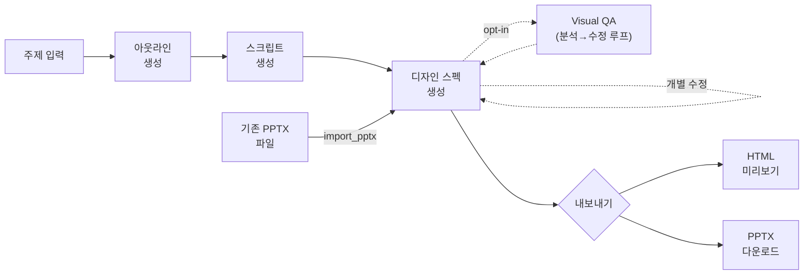
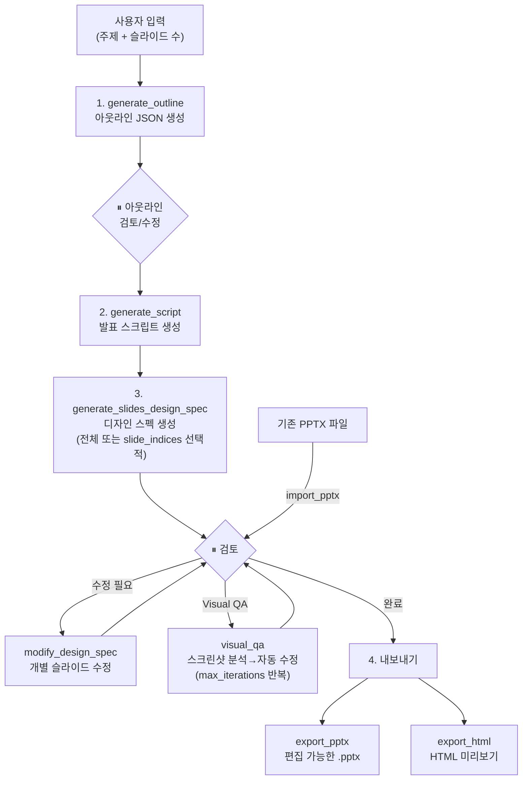

# Architecture

## 주요 기능

- **아웃라인 생성** — 주제와 슬라이드 수를 입력하면 구조화된 아웃라인 JSON을 생성
- **발표 스크립트 생성** — 아웃라인 기반으로 슬라이드별 발표 스크립트(speaker notes) 작성
- **디자인 스펙 생성** — 슬라이드별 정밀한 레이아웃을 PptxSlideSpec JSON으로 설계
- **슬라이드별 수정** — 개별 슬라이드의 디자인 스펙을 추가/수정/삭제 (전체 재생성 불필요)
- **Visual QA** — Playwright 스크린샷 + Claude Vision으로 시각적 결함 자동 감지 및 수정 (opt-in)
- **HTML 미리보기** — 디자인 스펙에서 결정론적으로 HTML 변환
- **PPTX 내보내기** — 디자인 스펙에서 편집 가능한 PPTX로 결정론적 변환
- **PPTX 임포트** — 기존 PPTX 파일을 디자인 스펙으로 역변환하여 편집·미리보기 (LLM 호출 없이 결정론적 파싱)
- **프로젝트 관리** — `project_id` 기반으로 중간 결과물 저장/로드, 중간 단계부터 재개 가능

## 생성 파이프라인



## 사용 워크플로우



- 모든 도구는 `project_id`를 자동 생성하여 `~/.ppt-generator/<UUID>/`에 결과물을 저장합니다
- `load_*` 도구에 `project_id`를 전달하면 중간 단계부터 재개할 수 있습니다
- 첫 슬라이드 생성 시 디자인 테마를 추출하여 후속 슬라이드의 시각적 일관성을 유지합니다

## Controller-Service 패턴

Controller-Service 패턴 + 의존성 주입(DI)을 사용합니다:

- **Controller** (`controller.py`): MCP 도구 인터페이스. `register_*_tools(mcp, service, project_service)` 함수로 도구를 등록하며, 내부에 `@mcp.tool()` 데코레이터가 적용된 함수를 정의합니다. docstring이 MCP 클라이언트에 도구 설명으로 노출됩니다.
- **Service** (`service.py`): 비즈니스 로직. Request 데이터클래스를 받아 Response 데이터클래스를 반환합니다.
- **DIContainer** (`di/container.py`): 프로바이더 자동 감지(Anthropic/Bedrock), Agent, Service 인스턴스를 생성하고 연결합니다. 지연 초기화(lazy init) 패턴을 사용합니다.
- **ModelFactory** (`di/model_factory.py`): Bedrock/Anthropic 프로바이더별 모델 인스턴스 생성 로직을 담당합니다. DIContainer에서 분리.

### Key Modules

| 모듈 | 역할 |
|------|------|
| `interfaces/schemas.py` | 내부 도메인 모델 (`@dataclass`) |
| `interfaces/llm_output_models.py` | LLM structured_output용 Pydantic 모델, `to_dataclass()`로 변환 |
| `interfaces/constants.py` | 모델 설정, 수치 상수, 프롬프트 re-export |
| `interfaces/prompts/*.prompt.md` | 프롬프트 템플릿 (`.prompt.md` 파일 → `__init__.py`에서 로딩) |
| `interfaces/spec_utils/` | PptxSlideSpec 파싱/검증/직렬화 공유 유틸리티 (패키지: parser, serializer, validator) |
| `interfaces/json_schemas.py` | Bedrock Structured Output용 JSON 스키마 정의 |
| `interfaces/text_measurement.py` | 폰트 메트릭 기반 텍스트 크기 추정 |
| `templates/layout_mapping.py` | layout_index → 슬라이드 레이아웃 매핑 (97종) |
| `tools/design/service.py` | 디자인 스펙 생성 — 복잡도 기반 고정 thinking budget |
| `tools/design/parallel_runner.py` | ThreadPoolExecutor 기반 슬라이드 병렬 생성, 토큰 집계 |
| `tools/visual_qa/service.py` | Visual QA — Playwright 스크린샷 + Claude Vision 분석 + 자동 수정 루프 |
| `di/model_factory.py` | LLM 모델 생성 팩토리 (Bedrock/Anthropic 프로바이더별) |
| `tools/pptx/slide_builder.py` | PptxSlideSpec → python-pptx 변환 |
| `tools/slides/html_renderer.py` | PptxSlideSpec → HTML 변환 |

## Pipeline Design Philosophy: Progressive Refinement

파이프라인은 **추상에서 구체로의 점진적 구체화(Progressive Refinement)** 원칙으로 설계되었습니다.

```
텍스트 (가장 추상적)
  → 아웃라인 (구조화된 JSON — 제목, 내용 요약, 레이아웃 인덱스)
    → 스크립트 (구체적 — 아웃라인 기반 발표 스크립트)
      → 디자인 스펙 (PptxSlideSpec JSON — LLM이 정밀한 레이아웃 설계)
        ├→ HTML 슬라이드 (결정론적 변환, 브라우저 미리보기용)
        └→ PPTX (SlideBuilder 직접 사용, 편집 가능한 포맷으로 변환)
```

> **디자인 스펙 기반 파이프라인**: 디자인 스펙(PptxSlideSpec JSON)을 중간 표현으로 사용하여
> HTML과 PPTX를 각각 결정론적으로 생성합니다. LLM 호출은 디자인 스펙 생성 단계에서만 발생하며,
> 이후 HTML/PPTX 변환은 모두 결정론적입니다.

**핵심 원칙:**

- **파일 기반 통신**: 모든 도구는 결과를 파일로 저장하고 파일 경로를 반환합니다. `project_id`만으로 도구를 체이닝할 수 있어 인라인 JSON 전달이 불필요하며, MCP 클라이언트의 컨텍스트 윈도우 토큰 사용을 최적화합니다.
- **슬라이드 단위 세분화**: `modify_design_spec` 도구로 중간 산출물(디자인 스펙)의 개별 슬라이드를 추가/수정/삭제할 수 있어, 전체 재생성 없이 반복적 개선이 가능합니다. 디자인 스펙은 `design_spec/slide_NN.json`, HTML은 `slides/slide_NN.html` 형식으로 슬라이드별 개별 파일에 저장됩니다.

## Concurrency

디자인 스펙 생성은 슬라이드별 독립 LLM 호출이므로 병렬 처리를 적용합니다. ([ADR-0018](adr/pipeline/0018-parallel-design-spec-and-prompt-caching.md))

**병렬 생성** (`tools/design/parallel_runner.py`):
- `generate_slides_design_spec`에서 `run_parallel_generation()`을 호출하여 `ThreadPoolExecutor`로 슬라이드를 병렬 생성
- `DESIGN_SPEC_PARALLEL` 환경변수(기본 8)로 최대 동시 워커 수 제어
- 워커마다 `design_service_factory(slide_type)`로 독립 Agent 인스턴스 생성 (strands Agent는 stateful이므로 공유 불가)
- `ProjectService._metadata_lock`으로 `project.json` 동시 쓰기 보호
- 첫 요청부터 전체 슬라이드를 병렬 실행 (워밍업 순차 실행 단계 없음)
- 토큰 사용량을 워커별로 수집하여 합산 (`ParallelResult` 반환)

**Thinking Budget (전체 Sonnet 모델):**
- Sonnet + structured_output (tool use/json_schema 기반) 조합에서 adaptive thinking은 출력 토큰을 예측 불가능하게 소비하여 `MaxTokensReachedException` 유발 → 고정 budget 필수 (ADR-0018)
- 디자인 스펙: `{"thinking": {"type": "enabled", "budget_tokens": N}}` — complexity에 따라 4K/8K/12K 차등 적용
- 아웃라인: 고정 8K budget
- Visual QA fix: 고정 2K budget
- `estimate_slide_complexity()` → `complexity_to_budget_tokens()` 로 매핑 (디자인 스펙만 해당)

**Prompt Caching — 현재 미사용:**
- Sonnet 4.6 + adaptive thinking 조합에서 `cacheWriteInputTokens` 만 발생하고 `cacheReadInputTokens=0` 이 재현되어 제거됨
- `CacheConfig(strategy="auto")`, Anthropic 쪽 `cache_control: ephemeral` 래퍼 모두 미적용
- 상세 근거 및 재도입 조건은 [ADR-0018](adr/pipeline/0018-parallel-design-spec-and-prompt-caching.md) 의 "재도입 조건 (캐싱)" 절 참조

## Token Usage Tracking & Cost Estimation

모든 LLM 호출 도구는 응답에 `token_usage`와 `estimated_cost`(USD)를 포함합니다.

**서비스 레이어:**
- `OutlineService`, `ScriptService`, `DesignService` 모두 `last_token_usage` 프로퍼티를 제공
- `log_token_usage()` 헬퍼가 strands `result.metrics.accumulated_usage`에서 토큰 정보를 추출, INFO 로깅 후 dict 반환

**컨트롤러 레이어:**
- `generate_outline`, `generate_script`: 응답 JSON에 `token_usage` 필드 포함
- `generate_slides_design_spec`: 모든 슬라이드의 토큰을 합산하여 `token_usage` + `estimated_cost` 포함
- `modify_design_spec`: add/update 시 `svc.last_token_usage`에서 토큰을 수집하여 `token_usage` + `estimated_cost` 포함 (delete 시에는 LLM 호출이 없으므로 미포함)

**가격 계산 (`estimate_cost()`):**
- `interfaces/utils.py`의 `_MODEL_PRICING` 딕셔너리에 모델별 가격 정의 (USD / 1M tokens)
- Bedrock 모델 ID (`global.anthropic.claude-opus-4-7` 등)는 `_MODEL_ID_ALIASES`로 정규화
- `inputTokens`, `outputTokens`, `cacheReadInputTokens`, `cacheWriteInputTokens` 각각 별도 단가 적용

## MCP 도구

### 생성 도구

| 도구                         | 설명                                                      |
| ---------------------------- | --------------------------------------------------------- |
| `generate_outline`           | 주제와 슬라이드 수를 기반으로 아웃라인 JSON 생성          |
| `generate_script`            | 아웃라인 기반 슬라이드별 발표 스크립트 생성               |
| `generate_slides_design_spec` | 슬라이드 디자인 스펙 생성 (전체 또는 선택적, 서버 내부 병렬 처리) |
| `modify_design_spec`         | 디자인 스펙의 개별 슬라이드 추가/수정/삭제                |
| `visual_qa`                  | 스크린샷 기반 시각적 결함 감지 및 자동 수정 (opt-in, Playwright 필요) |
| `export_html`                | 디자인 스펙에서 HTML 슬라이드 내보내기 (결정론적 변환)    |
| `export_pptx`                | 디자인 스펙에서 편집 가능한 PPTX 내보내기 (결정론적 변환) |
| `import_pptx`                | 기존 PPTX 파일을 디자인 스펙으로 역변환 (결정론적 파싱, HTML 미리보기 자동 생성) |

#### PPTX 임포트

`import_pptx`는 기존 PPTX 파일을 python-pptx 오브젝트 모델 기반으로 결정론적 파싱하여 DesignSpec으로 변환합니다. LLM 호출 없이 순수 파싱 로직으로 동작하므로 추가 비용이 없습니다.

- **지원 요소**: 텍스트박스, 도형(22종), 커넥터/선, 이미지, 배경, 발표자 노트
- **도형 22종**: Basic(3) + Arrows(5) + Polygons(7) + Stars(3) + Flowchart(3) + Line(1)
- **Graceful degradation**: 그룹 도형 → 평탄화, 테이블 → 도형 격자, 차트 → 경고, 비디오/오디오 → 무시
- **슬라이드 크기 정규화**: 외부 PPTX의 크기가 1280×720px이 아닌 경우 비례 스케일링
- 임포트 후 `modify_design_spec`, `visual_qa`, `export_html`, `export_pptx` 모두 즉시 사용 가능

> 상세 설계: [ADR-0027](adr/pipeline/0027-pptx-import-to-design-spec.md)

#### 디자인 스펙 병렬 생성

`generate_slides_design_spec`은 슬라이드별 독립 LLM 호출을 `ThreadPoolExecutor`로 병렬 처리합니다.

- **병렬 워커 수**: `DESIGN_SPEC_PARALLEL` 환경변수로 제어 (기본 `8`). API rate limit에 맞게 조절 가능
- **복잡도 기반 thinking budget**: complexity 1-2 → 4K, 3-4 → 8K, 5 → 12K budget_tokens 차등 적용 → 단순 슬라이드 토큰 절약, 복잡한 슬라이드 품질 유지

#### Visual QA 파이프라인

`visual_qa`는 디자인 스펙 생성 후 실제 렌더링 결과의 시각적 결함을 자동 감지·수정합니다. Playwright + Claude Vision 기반이며 opt-in 방식으로 사용자 동의 후에만 실행됩니다.

```
for iteration in range(max_iterations):    # 기본 2회
    1. Playwright 스크린샷 캡처 (1280×720, ThreadPoolExecutor 병렬)
    2. Claude Vision 분석 (asyncio.gather 병렬)
       → has_issues=false → "pass" / "fixed"
       → has_issues=true  → 수정 대상 분류
    3. LLM 디자인 스펙 수정 (asyncio.gather 병렬)
       → 스펙 저장 + HTML 재렌더링 → 다음 iteration에서 재검사
    종료: 이슈 없음 / 모든 수정 실패 / max_iterations 도달
```

**감지 이슈 타입 (10가지)**: `word_break` · `text_truncation` · `overlap` · `overflow` · `contrast` · `misalignment` · `wrong_vertical_alignment` · `inconsistent_font_size` · `inconsistent_spacing` · `arrow_disconnected`

**Scope 제약**: 시각적 속성(위치, 크기, 폰트, 색상, 정렬)만 수정하며 텍스트 콘텐츠는 변경하지 않습니다.

> Playwright 미설치 시 기존 기능에 영향 없습니다. 설치: `uv sync --group visual-qa && playwright install chromium`

### 프로젝트 관리 도구

| 도구                  | 설명                             |
| --------------------- | -------------------------------- |
| `list_projects`       | 기존 프로젝트 목록 조회          |
| `load_project_status` | 프로젝트 상태 및 메타데이터 로드 |
| `load_outline`        | 저장된 아웃라인 JSON 로드        |
| `load_script`         | 저장된 스크립트 JSON 로드        |
| `load_design_spec`    | 저장된 디자인 스펙 로드          |

## 새 도구 추가 패턴

1. `tools/` 하위에 새 디렉토리 생성 (`__init__.py`, `controller.py`, `service.py`)
2. `service.py`: Request를 받아 Response를 반환하는 클래스 작성
3. `controller.py`: `register_*_tools(mcp: FastMCP, service: XxxService, project_service: ProjectService)` 함수 작성. 내부에 `@mcp.tool()` 함수 정의
4. `schemas.py`에 Request/Response 데이터클래스 추가
5. `di/container.py`에 Service 생성 프로퍼티 추가 (지연 초기화)
6. `server.py`의 `create_server()`에서 `register_*_tools()` 호출 추가
