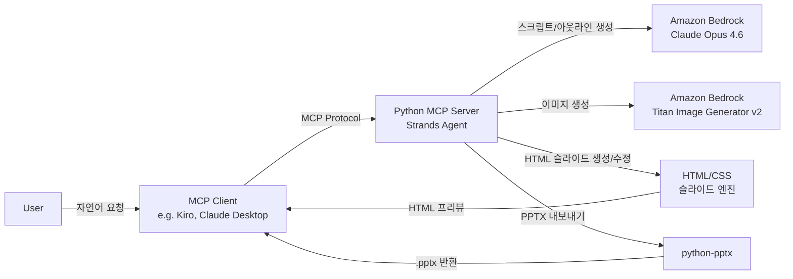
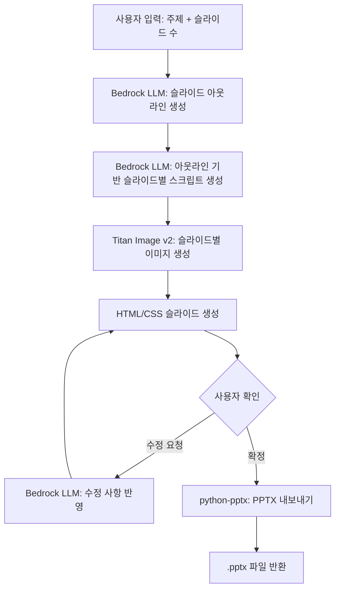
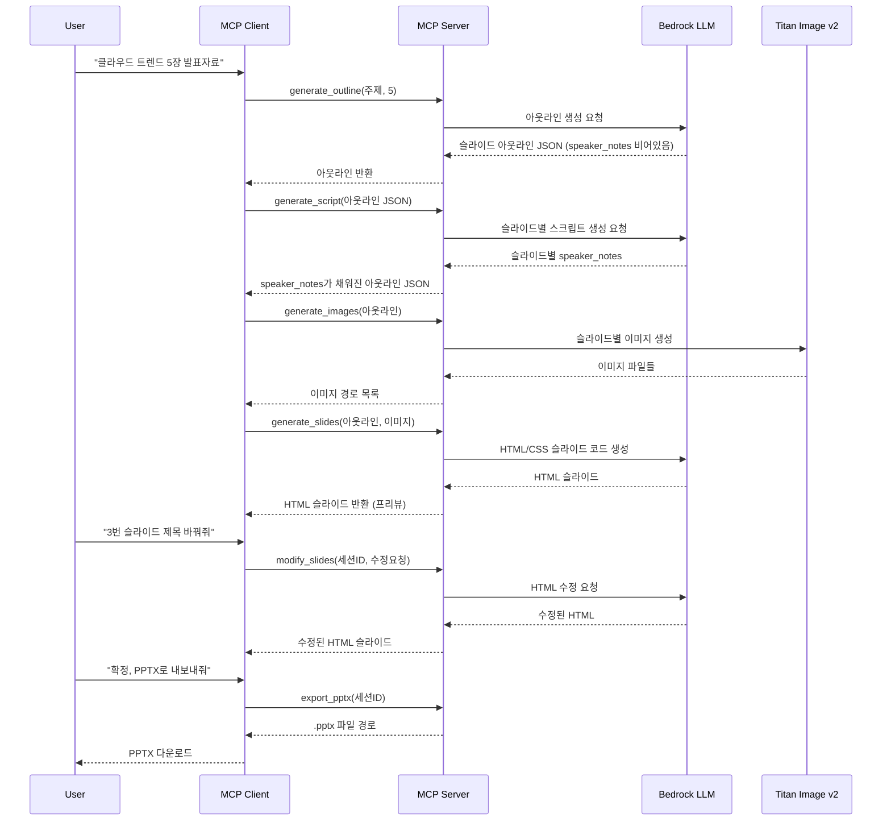

# PPT Generator (자동 프레젠테이션 생성 MCP 서버) ALPS

## Section 1. Overview

### 1.1. 목적

- 사용자가 주제 또는 문서를 입력하면 AI가 자동으로 HTML 기반 프레젠테이션을 생성하고, 사용자의 수정 요청을 반영한 뒤 최종적으로 편집 가능한 PPTX로 내보내는 Python MCP 서버 구축
- Amazon Bedrock LLM으로 콘텐츠를 생성하고, Titan Image Generator v2로 시각 자료를 생성하여, HTML/CSS 기반 슬라이드로 자유로운 디자인을 구현한 뒤 최종 PPTX로 변환하는 파이프라인 구현
- 기존 서비스(NotebookLM의 이미지 기반 편집 불가, Claude Cowork의 디자인 품질 부족)의 한계를 극복하고, HTML 기반 자유 레이아웃으로 고품질 디자인을 달성한 뒤 편집 가능한 PPTX로 내보내기를 목표로 함

### 1.2. 문서 제목

- PPT Generator: 자동 프레젠테이션 생성 MCP 서버

### 1.3. 작성자

- 이동균 <dongkyl@amazon.com>

### 1.4. 타겟 사용자

- 사내 직원 (회사 보고서, 발표 자료 등을 빠르게 생성해야 하는 임직원)

### 1.5. 핵심 문제

- 프레젠테이션 제작에 많은 시간과 디자인 역량이 필요함
- 기존 AI 슬라이드 생성 서비스는 편집 불가능한 이미지 출력(NotebookLM)이거나 디자인 품질이 부족(Claude Cowork)
- python-pptx의 레이아웃 제약으로 자유로운 디자인 구현이 어려움 (고정 플레이스홀더, 제한된 CSS 스타일링)
- 생성 후 수정이 어려워 사용자가 결과물을 반복적으로 재생성해야 하는 비효율

### 1.6. 솔루션 전략

- Amazon Bedrock LLM을 통한 콘텐츠 분석 및 슬라이드 아웃라인 자동 생성
- Amazon Titan Image Generator v2를 활용한 일관된 스타일의 시각 자료 생성
- HTML/CSS 기반 슬라이드 렌더링으로 자유로운 레이아웃과 고품질 디자인 구현 (python-pptx의 레이아웃 제약 극복)
- HTML 슬라이드 상태에서 사용자의 수정 요청을 반복적으로 반영하는 인터랙티브 수정 루프 지원
- 최종 확정된 HTML 슬라이드를 python-pptx로 변환하여 편집 가능한 PPTX 내보내기
- MCP(Model Context Protocol) 서버로 구현하여 다양한 AI 에이전트 환경에서 도구로 활용 가능

### 1.7. 핵심 차별점

- HTML/CSS 기반 자유 레이아웃으로 python-pptx 직접 생성 대비 월등한 디자인 품질
- 인터랙티브 수정 루프: 사용자가 결과물을 확인하고 수정 요청을 반복할 수 있어 최종 품질 향상
- 최종 PPTX 내보내기로 편집 가능한 결과물 제공 (텍스트, 도형, 이미지가 개별 객체)
- AWS 네이티브 서비스 기반 (Bedrock + Titan Image) 으로 사내 인프라와 자연스러운 통합
- MCP 프로토콜 지원으로 다양한 AI 클라이언트에서 호출 가능

---

## Section 2. MVP Goals and Key Metrics

### 2.1. 핵심 가설

- Bedrock LLM + Titan Image Generator v2 + HTML/CSS 슬라이드 + PPTX 내보내기 파이프라인으로, 콘텐츠와 디자인 품질이 모두 우수하고 수정이 용이한 프레젠테이션을 자동 생성할 수 있는가?

### 2.2. MVP 목표

1. 콘텐츠 품질: LLM이 생성한 슬라이드 아웃라인(제목, 본문 요점, 구조)이 입력 문서/주제를 정확히 반영하고 논리적으로 구성됨
2. 디자인 품질: HTML/CSS 기반 자유 레이아웃과 Titan Image 생성 이미지를 통해 전문적인 수준의 슬라이드 디자인 달성
3. 수정 용이성: HTML 슬라이드 상태에서 사용자의 수정 요청(텍스트 변경, 레이아웃 조정, 이미지 교체 등)이 즉시 반영됨
4. PPTX 내보내기: 최종 확정된 HTML 슬라이드가 편집 가능한 PPTX로 정확히 변환됨
5. 파이프라인 동작: MCP 서버를 통해 주제/문서 입력 → 콘텐츠 생성 → 이미지 생성 → HTML 슬라이드 생성 → 수정 → PPTX 내보내기의 전체 흐름이 end-to-end로 동작

### 2.3. 핵심 지표 (KPI)

| 지표 | 목표 |
|------|------|
| 콘텐츠 정확도 | 입력 내용 대비 핵심 포인트 누락 없음 |
| 디자인 만족도 | 내부 사용자 피드백 기반 긍정 평가 70% 이상 |
| 수정 반영 정확도 | 사용자 수정 요청 대비 정확 반영률 85% 이상 |
| PPTX 변환 충실도 | HTML 슬라이드 대비 PPTX 레이아웃·스타일 일치율 90% 이상 |
| PPTX 호환성 | PowerPoint/한쇼에서 레이아웃·폰트 깨짐 없이 편집 가능 |
| 생성 완료율 | 요청 대비 정상 생성 성공률 90% 이상 |

---

## Section 3. Demo Scenario

### 3.1. 데모 시나리오: 주제 기반 생성 및 수정

**시작점**: 사용자가 MCP 클라이언트에서 "2024년 클라우드 컴퓨팅 트렌드에 대한 5장짜리 발표자료 만들어줘"라고 요청

**사용자 여정**:
1. 사용자가 주제와 슬라이드 수를 자연어로 입력
2. MCP 서버가 Bedrock LLM을 호출하여 슬라이드 아웃라인 생성 (speaker_notes 비어있음)
3. 사용자가 아웃라인을 확인하고 확정
4. 아웃라인을 기반으로 슬라이드별 발표자 노트(스크립트) 생성
5. Titan Image Generator v2로 각 슬라이드에 필요한 이미지 생성
6. 아웃라인과 이미지를 결합하여 HTML/CSS 기반 슬라이드 생성 및 반환
7. 사용자가 HTML 슬라이드를 확인하고 수정 요청 ("3번 슬라이드 제목 변경해줘", "배경색을 파란색으로 바꿔줘" 등)
8. MCP 서버가 수정 요청을 반영하여 HTML 슬라이드 업데이트 (7~8 반복)
9. 사용자가 최종 확정 후 PPTX 내보내기 요청
10. HTML 슬라이드를 python-pptx로 변환하여 편집 가능한 PPTX 반환

**끝점**: 편집 가능한 .pptx 파일 (발표자 노트에 스크립트 포함)

**검증 목표**: 콘텐츠 품질, 디자인 품질, 수정 용이성, PPTX 변환 충실도, 파이프라인 동작

---

## Section 4. High-Level Architecture

### 4.1. 시스템 구성도

### 4.2. 처리 파이프라인

### 4.3. 기술 스택

| 구성 요소 | 기술 스택 | 선택 이유 |
|-----------|-----------|-----------|
| MCP 서버 | Python + MCP Protocol | 다양한 AI 클라이언트에서 도구로 호출 가능 |
| 에이전트 프레임워크 | AWS Strands SDK | Bedrock 네이티브 통합, 멀티스텝 워크플로우 관리 |
| LLM | Amazon Bedrock - Claude Opus 4.6 | 고품질 콘텐츠 생성, 구조화된 출력, HTML/CSS 코드 생성 |
| 이미지 생성 | Amazon Bedrock - Titan Image Generator v2 | 색상 팔레트 조건, 스타일 일관성 유지 |
| 슬라이드 렌더링 | HTML/CSS | 자유로운 레이아웃, 풍부한 스타일링, LLM의 코드 생성 능력 활용 |
| PPTX 내보내기 | python-pptx | HTML 슬라이드를 편집 가능한 PPT 객체로 변환 (텍스트, 이미지, 도형 분리) |

---

## Section 5. Design Specification

### 5.1. MCP Tool 인터페이스

이 프로젝트는 MCP 서버로 별도 UI가 없으며, MCP 클라이언트를 통해 아래 도구들을 호출합니다.

| Tool 이름 | 매핑 기능 | 입력 | 출력 |
|-----------|-----------|------|------|
| `generate_outline` | F1 | 주제, 슬라이드 수 | 아웃라인 JSON (제목, 본문, 이미지 아이디어, 레이아웃 타입, speaker_notes 비어있음) |
| `generate_script` | F2 | 아웃라인 JSON | 아웃라인 JSON (speaker_notes 채워짐) |
| `generate_images` | F3 | 슬라이드 아웃라인 | 생성된 이미지 파일 경로 목록 |
| `generate_slides` | F4 | 슬라이드 아웃라인, 이미지 경로 | HTML 슬라이드 (파일 경로 또는 HTML 문자열) |
| `modify_slides` | F5 | 세션 ID, 수정 요청 (자연어) | 수정된 HTML 슬라이드 |
| `export_pptx` | F6 | 세션 ID | .pptx 파일 경로 |

### 5.2. 사용자 흐름

---

## Section 6. Requirements Summary

### 6.1. 기능 요구사항

| ID | 기능 | 설명 | 우선순위 |
|----|------|------|----------|
| F1 | 슬라이드 아웃라인 생성 | 사용자가 입력한 주제와 슬라이드 수를 기반으로 Bedrock LLM이 슬라이드 아웃라인 JSON 생성 (speaker_notes 비어있음) | Must-Have |
| F2 | 발표 스크립트 생성 | 아웃라인 JSON을 기반으로 슬라이드별 발표자 노트(speaker_notes) 생성 | Must-Have |
| F3 | 이미지 생성 | Titan Image Generator v2로 각 슬라이드에 필요한 이미지를 일관된 스타일로 생성 | Must-Have |
| F4 | HTML 슬라이드 생성 | 아웃라인과 이미지를 결합하여 HTML/CSS 기반의 자유 레이아웃 슬라이드 생성. 발표자 노트 포함 | Must-Have |
| F5 | 슬라이드 수정 | 사용자의 자연어 수정 요청을 받아 HTML 슬라이드를 업데이트하는 인터랙티브 수정 루프 | Must-Have |
| F6 | PPTX 내보내기 | 최종 확정된 HTML 슬라이드를 python-pptx로 변환하여 편집 가능한 PPTX 파일 생성. 발표자 노트 포함 | Must-Have |

### 6.2. 비기능 요구사항

| ID | 항목 | 설명 |
|----|------|------|
| NF1 | PPTX 호환성 | 내보내기된 PPTX가 PowerPoint/한쇼에서 레이아웃·폰트 깨짐 없이 정상 편집 가능 |
| NF2 | 한글 지원 | HTML 슬라이드 및 PPTX 모두에서 한글 콘텐츠와 한글 폰트가 정상적으로 렌더링 |
| NF3 | MCP 호환성 | MCP Protocol 표준을 준수하여 다양한 MCP 클라이언트에서 호출 가능 |
| NF4 | HTML 슬라이드 프리뷰 | HTML 슬라이드가 MCP 클라이언트에서 시각적으로 확인 가능한 형태로 반환 |

---

## Section 7. Feature-Level Specification

### 7.1. F1: 슬라이드 아웃라인 생성

#### 7.1.1 사용자 스토리
- As a 사내 직원, I want to 주제를 입력하면 슬라이드 아웃라인이 자동 생성되길 원한다, so that 주제에 맞는 최적의 슬라이드 구성을 빠르게 얻을 수 있다.

#### 7.1.2 흐름
1. MCP 클라이언트에서 `generate_outline(topic, num_slides)` 호출
2. Strands 에이전트가 Bedrock LLM에 주제와 슬라이드 수 전달
3. LLM이 주제를 분석하여 슬라이드별 제목/본문 요점/이미지 아이디어/레이아웃 타입을 JSON으로 생성 (speaker_notes는 빈 문자열)
4. 아웃라인 JSON 반환

#### 7.1.3 기술 설명
- Bedrock Claude Opus 4.6 호출 (Strands SDK 경유)
- 프롬프트: 주제를 기반으로 구조화된 JSON 아웃라인 생성 요청
- 출력 JSON 스키마: `{ slides: [{ title, bullets: [], image_idea, layout_type, speaker_notes: "" }] }`
- layout_type: `title`, `text_image`, `text_only`, `chart`, `closing` 등 (HTML 슬라이드 생성 시 디자인 힌트로 활용)
- speaker_notes는 빈 문자열로 생성되며, 이후 generate_script에서 채워짐

#### 7.1.4 엣지 케이스
- 주제가 너무 모호한 경우 → LLM이 합리적으로 해석하여 생성
- 빈 주제 입력 → 입력 검증 후 에러 반환
- LLM이 유효하지 않은 JSON 반환 → 재시도 또는 에러 반환

#### 7.1.5 인수 기준
- 주제를 입력하면 구조화된 슬라이드 아웃라인 JSON이 반환된다
- 각 슬라이드에 제목, 본문 요점, 이미지 아이디어, 레이아웃 타입이 포함된다
- speaker_notes는 빈 문자열이다

### 7.2. F2: 발표 스크립트 생성

#### 7.2.1 사용자 스토리
- As a 사내 직원, I want to 아웃라인을 기반으로 슬라이드별 발표 스크립트가 자동 생성되길 원한다, so that 각 슬라이드에 맞는 자연스러운 발표자 노트를 얻을 수 있다.

#### 7.2.2 흐름
1. MCP 클라이언트에서 `generate_script(outline_json)` 호출
2. Strands 에이전트가 Bedrock Claude Opus 4.6에 아웃라인 JSON 전달
3. LLM이 각 슬라이드의 제목과 본문 요점을 기반으로 슬라이드별 발표자 노트 생성
4. speaker_notes가 채워진 아웃라인 JSON 반환

#### 7.2.3 기술 설명
- Bedrock Claude Opus 4.6 호출 (Strands SDK 경유)
- 프롬프트: 아웃라인 JSON을 기반으로 슬라이드별 발표자 노트(speaker_notes) 생성 요청
- 출력 JSON 스키마: `{ scripts: [{ slide_index, speaker_notes }] }`
- 출력의 speaker_notes를 원본 아웃라인의 각 슬라이드에 적용하여 반환

#### 7.2.4 엣지 케이스
- 아웃라인이 비어있는 경우 → 입력 검증 후 에러 반환
- LLM이 유효하지 않은 JSON 반환 → 재시도 또는 에러 반환
- 일부 슬라이드의 speaker_notes가 누락된 경우 → 기존 값(빈 문자열) 유지

#### 7.2.5 인수 기준
- 아웃라인 JSON을 입력하면 speaker_notes가 채워진 아웃라인 JSON이 반환된다
- 각 슬라이드의 speaker_notes가 해당 슬라이드 내용에 맞는 자연스러운 발표 스크립트를 포함한다
- 슬라이드 간 자연스러운 전환이 반영된다

### 7.3. F3: 이미지 생성

#### 7.3.1 사용자 스토리
- As a 사내 직원, I want to 슬라이드에 어울리는 이미지가 자동 생성되길 원한다, so that 이미지를 직접 찾거나 만들 필요 없이 시각적으로 완성된 슬라이드를 얻을 수 있다.

#### 7.3.2 흐름
1. MCP 클라이언트에서 `generate_images(outline)` 호출
2. 아웃라인 JSON에서 각 슬라이드의 `image_idea` 추출
3. Titan Image Generator v2에 이미지 생성 요청 (영어 프롬프트로 변환)
4. 생성된 이미지를 로컬에 저장하고 파일 경로 목록 반환

#### 7.3.3 기술 설명
- Amazon Bedrock Titan Image Generator v2 호출
- image_idea를 영어 프롬프트로 변환하여 요청
- 색상 팔레트 조건을 통해 슬라이드 전반의 이미지 스타일 통일
- 이미지 크기: 슬라이드 레이아웃에 맞는 해상도로 생성
- 출력: PNG 파일로 로컬 임시 디렉토리에 저장
- 이미지는 HTML 슬라이드에서 base64 인코딩 또는 파일 경로로 참조

#### 7.3.4 엣지 케이스
- image_idea가 없는 슬라이드 → 이미지 생성 건너뜀
- Titan Image API 호출 실패 → 해당 슬라이드는 이미지 없이 진행, 에러 로그 기록
- layout_type이 `text_only`인 경우 → 이미지 생성 건너뜀

#### 7.3.5 인수 기준
- 아웃라인의 image_idea에 따라 슬라이드별 이미지가 생성된다
- 생성된 이미지들이 일관된 스타일을 유지한다
- 이미지가 필요 없는 슬라이드는 건너뛴다
- 이미지 파일 경로 목록이 반환된다

### 7.4. F4: HTML 슬라이드 생성

#### 7.4.1 사용자 스토리
- As a 사내 직원, I want to 아웃라인과 이미지가 결합된 전문적인 디자인의 슬라이드를 즉시 확인하길 원한다, so that 결과물을 미리 검토하고 수정 요청을 할 수 있다.

#### 7.4.2 흐름
1. MCP 클라이언트에서 `generate_slides(outline, image_paths)` 호출
2. 슬라이드마다 `LAYOUT_REGIONS` 좌표를 사용하여 `position:absolute` div 골격(skeleton) HTML을 코드로 생성
3. Bedrock LLM에 골격 HTML과 아웃라인 JSON을 전달하여, 각 `data-region` div 내부의 `<!-- CONTENT:xxx -->` 마커를 실제 HTML 컨텐츠로 교체하도록 요청
4. LLM 응답에서 section을 추출하고, `_validate_region_styles()`로 좌표를 검증/복원
5. 모든 슬라이드의 section을 합산하여 HTML 템플릿에 삽입
6. 세션 ID를 부여하고 HTML 슬라이드 상태를 서버에 저장
7. HTML 슬라이드와 세션 ID 반환

#### 7.4.3 기술 설명
- Bedrock Claude Opus 4.6 호출 (Strands SDK 경유)
- **레이아웃 골격 기반 생성**: `build_layout_skeleton()` 함수가 `LAYOUT_REGIONS` 좌표로 `position:absolute` div 골격을 생성. LLM은 `SLIDES_REGION_SYSTEM_PROMPT`를 사용하여 각 `data-region` div 내부 컨텐츠만 채움
- **좌표 검증/복원**: `_validate_region_styles()`가 LLM이 변경한 좌표를 `LAYOUT_REGIONS` 원본으로 복원
- 슬라이드 규격: 16:9 비율 (1280×720px)
- HTML 구조:
  - 각 슬라이드를 `<section id="slide-{N}" data-speaker-notes="...">` 태그로 구분
  - `data-wrapper="true"` 래퍼 div에 배경색 (Tailwind 클래스 + 인라인 background-color)
  - `data-region` div들이 `position:absolute`로 고정 좌표에 배치 (title, subtitle, body, image)
  - 영역 내부에서 TailwindCSS 유틸리티로 자유 디자인
  - 이미지는 `{IMAGE_N}` placeholder → 후처리로 `file://` 경로 치환
  - 발표자 노트는 `data-speaker-notes` 속성에 포함
- 세션 관리: 세션 ID로 현재 HTML 슬라이드 상태를 서버 메모리에 유지 (수정 루프 지원)
- 출력: HTML 문자열 (세션 ID 포함)

#### 7.4.4 엣지 케이스
- 이미지 파일이 누락된 경우 → 해당 슬라이드는 텍스트만으로 구성
- LLM이 유효하지 않은 HTML 반환 → 기본 구조로 감싸서 반환하거나 재시도
- 아웃라인이 매우 많은 슬라이드를 포함하는 경우 → LLM 토큰 한도 내에서 분할 처리

#### 7.4.5 인수 기준
- 아웃라인과 이미지를 입력하면 HTML/CSS 슬라이드가 생성된다
- 각 슬라이드가 layout_type에 맞는 자유로운 디자인을 갖는다
- 이미지가 적절한 위치에 삽입되어 있다
- 발표자 노트가 포함되어 있다
- 세션 ID가 반환되어 이후 수정/내보내기에 사용할 수 있다
- MCP 클라이언트에서 HTML 슬라이드를 시각적으로 확인할 수 있다

### 7.5. F5: 슬라이드 수정

#### 7.5.1 사용자 스토리
- As a 사내 직원, I want to 생성된 슬라이드에 대해 자연어로 수정 요청을 하면 즉시 반영되길 원한다, so that 디자인 도구를 직접 다루지 않아도 원하는 결과물을 얻을 수 있다.

#### 7.5.2 흐름
1. MCP 클라이언트에서 `modify_slides(session_id, modification_request)` 호출
2. 서버에서 세션 ID에 해당하는 현재 HTML 슬라이드 상태를 로드
3. Bedrock LLM에 현재 HTML과 수정 요청을 전달
4. LLM이 수정 사항을 반영한 새 HTML 생성
5. 세션의 HTML 슬라이드 상태를 업데이트하고 반환

#### 7.5.3 기술 설명
- Bedrock Claude Opus 4.6 호출 (Strands SDK 경유)
- 프롬프트: 현재 HTML 슬라이드 코드와 사용자의 자연어 수정 요청을 전달하여 수정된 HTML 반환 요청
- 지원하는 수정 유형:
  - 텍스트 변경: 제목, 본문 내용, 불릿 포인트 수정/추가/삭제
  - 레이아웃 조정: 요소 위치, 크기, 간격 변경
  - 스타일 변경: 색상, 폰트, 배경 변경
  - 이미지 교체: 새 이미지 아이디어로 Titan Image 재생성 후 교체
  - 슬라이드 추가/삭제/순서 변경
  - 발표자 노트 수정
- 세션 상태: 수정 이력을 유지하여 이전 상태로 되돌리기 가능 (선택적)

#### 7.5.4 엣지 케이스
- 존재하지 않는 세션 ID → 에러 반환
- 모호한 수정 요청 → LLM이 합리적으로 해석하여 반영
- 이미지 재생성이 필요한 수정 → Titan Image 호출 후 HTML 업데이트
- 수정 요청이 전체 구조를 크게 변경하는 경우 → LLM이 전체 HTML을 재생성

#### 7.5.5 인수 기준
- 세션 ID와 수정 요청을 입력하면 수정된 HTML 슬라이드가 반환된다
- 텍스트 변경, 레이아웃 조정, 스타일 변경이 정확히 반영된다
- 수정되지 않은 부분은 기존 상태를 유지한다
- 반복적인 수정 요청이 누적적으로 반영된다

### 7.6. F6: PPTX 내보내기

#### 7.6.1 사용자 스토리
- As a 사내 직원, I want to 최종 확정된 슬라이드를 편집 가능한 PPTX 파일로 내보내길 원한다, so that PowerPoint에서 추가 편집하고 발표에 활용할 수 있다.

#### 7.6.2 흐름
1. MCP 클라이언트에서 `export_pptx(session_id)` 호출
2. 서버에서 세션 ID에 해당하는 최종 HTML 슬라이드 상태를 로드
3. HTML 슬라이드를 파싱하여 각 슬라이드의 요소(텍스트, 이미지, 도형, 위치, 스타일) 추출
4. python-pptx로 추출된 요소를 개별 객체로 변환하여 PPTX 생성:
   - HTML 텍스트 요소 → PPTX 텍스트 상자 (위치, 크기, 폰트 스타일 반영)
   - HTML 이미지 → PPTX 이미지 객체 (위치, 크기 반영, alt-text 추가)
   - HTML 배경 → PPTX 슬라이드 배경
   - HTML `data-speaker-notes` → PPTX 발표자 노트
5. 완성된 .pptx 파일 경로 반환

#### 7.6.3 기술 설명
- HTML 파싱: BeautifulSoup로 HTML 슬라이드 DOM 파싱
- **data-region 기반 요소 추출 (우선)**: `data-wrapper="true"` div가 있으면 region 기반 로직 사용
  - `data-region` div의 `position:absolute` style에서 좌표 직접 추출
  - region 좌표를 px → inches → EMU 변환하여 PPTX 요소 정확한 위치에 배치
  - `data-wrapper` div에서 인라인 `background-color` 추출하여 슬라이드 배경 설정
  - title/subtitle 영역은 bold 처리
- **레거시 폴백**: `data-wrapper` 없으면 인라인 style 기반 기존 로직으로 처리
- 좌표 변환: HTML px 좌표를 PPTX EMU(English Metric Units) 좌표로 변환
  - 슬라이드 크기: 13.333 × 7.5인치 (표준 16:9)
  - 변환 비율: 1280×720px 기준으로 비례 매핑
- python-pptx 객체 매핑:
  - `data-region` 텍스트 → `_add_textbox_at()` (region 좌표 사용)
  - `data-region` 이미지 → `_add_picture()` (region 좌표 사용)
  - `data-wrapper` 배경 → `slide.background` 설정
  - 레거시 `
`, `
`, `<h1>`~`<h6>` → `slide.shapes.add_textbox()` (인라인 style)
  - 레거시 `` → `slide.shapes.add_picture()` (인라인 style)
- 폰트: 한글 호환 폰트 사용 (맑은 고딕)
- 발표자 노트: 각 슬라이드의 notes 영역에 스크립트 삽입
- 출력: 로컬 파일 시스템에 .pptx 저장

#### 7.6.4 엣지 케이스
- HTML에 복잡한 CSS (gradient, animation, transform 등)가 포함된 경우 → PPTX에서 지원되는 범위로 근사 변환
- 이미지 base64 디코딩 실패 → 해당 이미지 건너뛰고 텍스트만 배치
- HTML 구조가 예상 포맷과 다른 경우 → 최대한 추출 시도, 실패 시 기본 텍스트 슬라이드로 폴백
- 세션이 만료되었거나 존재하지 않는 경우 → 에러 반환

#### 7.6.5 인수 기준
- 세션 ID를 입력하면 .pptx 파일이 생성된다
- HTML 슬라이드의 텍스트, 이미지, 도형이 PPTX에서 개별 객체로 분리되어 편집 가능하다
- 요소의 위치와 크기가 HTML 슬라이드와 유사하게 재현된다
- PowerPoint/한쇼에서 레이아웃·폰트 깨짐 없이 열린다
- 발표자 노트에 스크립트가 포함되어 있다
- 이미지에 대체 텍스트가 포함되어 있다

---

## Section 8. MVP Metrics

### 8.1. 수집 데이터 및 측정 방법

| KPI | 수집 데이터 | 측정 방법 | 성공 임계값 |
|-----|-----------|-----------|------------|
| 콘텐츠 정확도 | 생성된 스크립트/아웃라인 vs 입력 주제 | 내부 사용자 리뷰 (핵심 포인트 누락 여부 체크리스트) | 핵심 포인트 누락 없음 |
| 디자인 만족도 | 사용자 피드백 설문 | 생성된 HTML 슬라이드에 대한 5점 척도 설문 (레이아웃, 색상, 이미지 품질) | 긍정 평가(4점 이상) 70% 이상 |
| 수정 반영 정확도 | 수정 요청 vs 반영 결과 | 사용자가 요청한 수정 사항이 정확히 반영되었는지 평가 | 85% 이상 |
| PPTX 변환 충실도 | HTML 슬라이드 vs 내보내기된 PPTX | HTML 원본과 PPTX의 레이아웃·스타일 비교 검토 | 90% 이상 일치 |
| PPTX 호환성 | 편집 테스트 결과 | PowerPoint/한쇼에서 열어 텍스트 편집, 이미지 이동, 폰트 확인 수동 테스트 | 깨짐 현상 0건 |
| 생성 완료율 | MCP 서버 로그 (요청 수, 성공/실패 수) | 전체 요청 대비 정상 생성 성공률 | 90% 이상 |

### 8.2. 데이터 수집 방법

- MCP 서버 로그: 각 tool 호출의 요청/응답/에러를 로깅
- 사용자 피드백: 내부 테스트 그룹 대상 설문 (MVP 테스트 기간)
- 호환성 테스트: 내보내기된 PPTX 샘플을 PowerPoint/한쇼에서 수동 검증
- 변환 충실도 테스트: HTML 슬라이드 스크린샷과 PPTX 스크린샷을 비교 검토

---

## Section 9. Out of Scope

### 9.1. MVP 제외 항목

- 문서/PDF 기반 변환: 사용자가 PDF를 업로드하여 슬라이드로 변환하는 기능 (시나리오 B)
- 차트/도표 자동 생성: 데이터 기반 편집 가능한 차트 삽입 (PPTX 차트 객체)
- 브랜드 팔레트 커스터마이징: 사용자가 기업 컬러/로고를 지정하여 적용
- 사실 확인 기능: LLM을 통한 생성 콘텐츠의 사실관계 자동 검증
- 다중 템플릿 선택: 사용자가 여러 디자인 템플릿 중 선택
- 실시간 협업: 여러 사용자가 동시에 같은 슬라이드를 편집
- 수정 이력 되돌리기 (Undo): 이전 수정 상태로 되돌리는 기능 (향후 고려)

### 9.2. 향후 로드맵

- Phase 2: 문서/PDF 기반 변환, 브랜드 팔레트 커스터마이징, 수정 이력 되돌리기
- Phase 3: 차트 자동 생성, 다중 템플릿 선택
- Phase 4: 사실 확인, 실시간 협업

---
