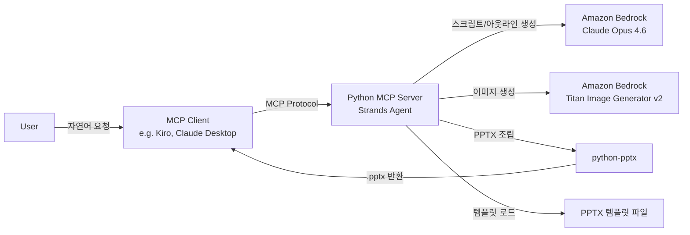
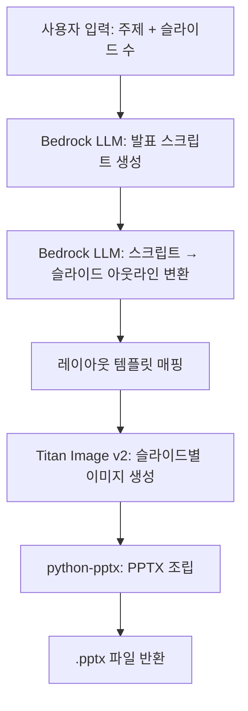
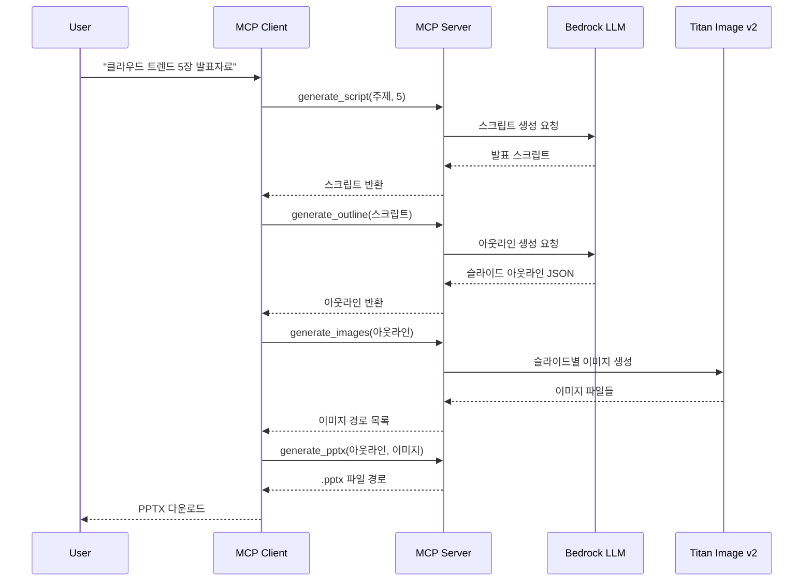

# PPT Generator (자동 프레젠테이션 생성 MCP 서버) ALPS

## Section 1. Overview

### 1.1. 목적

- 사용자가 주제 또는 문서를 입력하면 AI가 자동으로 편집 가능한 PPTX 프레젠테이션을 생성하는 Python MCP 서버 구축
- Amazon Bedrock LLM으로 콘텐츠를 생성하고, Titan Image Generator v2로 시각 자료를 생성하여, python-pptx로 편집 가능한 PPTX 파일을 조립하는 파이프라인 구현
- 기존 서비스(NotebookLM의 이미지 기반 편집 불가, Claude Cowork의 디자인 품질 부족)의 한계를 극복하고, GenSpark AI Slides 수준의 편집 가능한 고품질 PPT 자동 생성을 목표로 함

### 1.2. 문서 제목

- PPT Generator: 자동 프레젠테이션 생성 MCP 서버

### 1.3. 작성자

- 이동균 <dongkyl@amazon.com>

### 1.4. 타겟 사용자

- 사내 직원 (회사 보고서, 발표 자료 등을 빠르게 생성해야 하는 임직원)

### 1.5. 핵심 문제

- 프레젠테이션 제작에 많은 시간과 디자인 역량이 필요함
- 기존 AI 슬라이드 생성 서비스는 편집 불가능한 이미지 출력(NotebookLM)이거나 디자인 품질이 부족(Claude Cowork)
- 편집 가능한 PPTX를 생성하면서도 전문적인 디자인 품질을 갖춘 솔루션이 부재

### 1.6. 솔루션 전략

- Amazon Bedrock LLM을 통한 콘텐츠 분석 및 슬라이드 아웃라인 자동 생성
- Amazon Titan Image Generator v2를 활용한 일관된 스타일의 시각 자료 생성
- python-pptx 기반으로 텍스트/이미지/차트가 개별 객체로 분리된 편집 가능한 PPTX 출력
- 사전 정의된 디자인 템플릿을 통한 레이아웃 매핑으로 전문적 디자인 품질 확보
- MCP(Model Context Protocol) 서버로 구현하여 다양한 AI 에이전트 환경에서 도구로 활용 가능

### 1.7. 핵심 차별점

- 편집 가능한 PPTX 출력 (텍스트, 도형, 이미지가 개별 객체)
- AWS 네이티브 서비스 기반 (Bedrock + Titan Image) 으로 사내 인프라와 자연스러운 통합
- MCP 프로토콜 지원으로 다양한 AI 클라이언트에서 호출 가능
- 브랜드 팔레트/템플릿 적용을 통한 일관된 기업 디자인

---

## Section 2. MVP Goals and Key Metrics

### 2.1. 핵심 가설

- Bedrock LLM + Titan Image Generator v2 + python-pptx 파이프라인으로, 콘텐츠와 디자인 품질이 모두 우수한 편집 가능한 PPTX를 자동 생성할 수 있는가?

### 2.2. MVP 목표

1. 콘텐츠 품질: LLM이 생성한 슬라이드 아웃라인(제목, 본문 요점, 구조)이 입력 문서/주제를 정확히 반영하고 논리적으로 구성됨
2. 디자인 품질: 템플릿 기반 레이아웃 매핑과 Titan Image 생성 이미지를 통해 전문적인 수준의 슬라이드 디자인 달성
3. 편집 가능성: 생성된 PPTX의 텍스트, 이미지, 도형이 모두 개별 객체로 분리되어 PowerPoint에서 정상 편집 가능
4. 파이프라인 동작: MCP 서버를 통해 주제/문서 입력 → 콘텐츠 생성 → 이미지 생성 → PPTX 조립의 전체 흐름이 end-to-end로 동작

### 2.3. 핵심 지표 (KPI)

| 지표 | 목표 |
|------|------|
| 콘텐츠 정확도 | 입력 내용 대비 핵심 포인트 누락 없음 |
| 디자인 만족도 | 내부 사용자 피드백 기반 긍정 평가 70% 이상 |
| PPTX 호환성 | PowerPoint/한쇼에서 레이아웃·폰트 깨짐 없이 편집 가능 |
| 생성 완료율 | 요청 대비 PPTX 정상 생성 성공률 90% 이상 |

---

## Section 3. Demo Scenario

### 3.1. 데모 시나리오: 주제 기반 생성

**시작점**: 사용자가 MCP 클라이언트에서 "2024년 클라우드 컴퓨팅 트렌드에 대한 5장짜리 발표자료 만들어줘"라고 요청

**사용자 여정**:
1. 사용자가 주제와 슬라이드 수를 자연어로 입력
2. MCP 서버가 Bedrock LLM을 호출하여 발표 스크립트 생성
3. 발표 스크립트를 기반으로 슬라이드 아웃라인(제목, 본문 요점, 이미지 아이디어) 생성
4. 아웃라인 기반으로 레이아웃 템플릿 자동 매핑
5. Titan Image Generator v2로 각 슬라이드에 필요한 이미지 생성
6. python-pptx로 PPTX 파일 조립 및 반환

**끝점**: 편집 가능한 .pptx 파일 (발표자 노트에 스크립트 포함)

**검증 목표**: 콘텐츠 품질, 디자인 품질, 편집 가능성, 파이프라인 동작

---

## Section 4. High-Level Architecture

### 4.1. 시스템 구성도

### 4.2. 처리 파이프라인

### 4.3. 기술 스택

| 구성 요소 | 기술 스택 | 선택 이유 |
|-----------|-----------|-----------|
| MCP 서버 | Python + MCP Protocol | 다양한 AI 클라이언트에서 도구로 호출 가능 |
| 에이전트 프레임워크 | AWS Strands SDK | Bedrock 네이티브 통합, 멀티스텝 워크플로우 관리 |
| LLM | Amazon Bedrock - Claude Opus 4.6 | 고품질 콘텐츠 생성, 구조화된 출력 |
| 이미지 생성 | Amazon Bedrock - Titan Image Generator v2 | 색상 팔레트 조건, 스타일 일관성 유지 |
| PPTX 생성 | python-pptx | 편집 가능한 PPT 객체 생성 (텍스트, 이미지, 차트 분리) |
| 템플릿 | .pptx 마스터 템플릿 파일 | 사전 정의된 레이아웃으로 디자인 품질 확보 |

---

## Section 5. Design Specification

### 5.1. MCP Tool 인터페이스

이 프로젝트는 MCP 서버로 별도 UI가 없으며, MCP 클라이언트를 통해 아래 도구들을 호출합니다.

| Tool 이름 | 매핑 기능 | 입력 | 출력 |
|-----------|-----------|------|------|
| `generate_script` | F1 | 주제, 슬라이드 수 | 발표 스크립트 (텍스트) |
| `generate_outline` | F2, F3 | 발표 스크립트 | 슬라이드 아웃라인 JSON (제목, 본문, 이미지 아이디어, 레이아웃 타입) |
| `generate_images` | F4 | 슬라이드 아웃라인 | 생성된 이미지 파일 경로 목록 |
| `generate_pptx` | F5 | 슬라이드 아웃라인, 이미지 경로 | .pptx 파일 경로 |

### 5.2. 사용자 흐름

---

## Section 6. Requirements Summary

### 6.1. 기능 요구사항

| ID | 기능 | 설명 | 우선순위 |
|----|------|------|----------|
| F1 | 발표 스크립트 생성 | 사용자가 입력한 주제와 슬라이드 수를 기반으로 Bedrock LLM이 발표 스크립트 생성 | Must-Have |
| F2 | 슬라이드 아웃라인 생성 | 발표 스크립트를 기반으로 슬라이드별 제목, 본문 요점, 이미지 아이디어를 구조화된 형태로 생성 | Must-Have |
| F3 | 레이아웃 템플릿 매핑 | 아웃라인의 슬라이드 유형(제목, 텍스트+이미지, 차트 등)에 따라 사전 정의된 레이아웃 템플릿 자동 선택 | Must-Have |
| F4 | 이미지 생성 | Titan Image Generator v2로 각 슬라이드에 필요한 이미지를 일관된 스타일로 생성 | Must-Have |
| F5 | PPTX 조립 및 반환 | python-pptx로 텍스트/이미지/도형이 개별 객체로 분리된 편집 가능한 PPTX 파일 생성 및 반환. 발표자 노트에 스크립트 포함 | Must-Have |

### 6.2. 비기능 요구사항

| ID | 항목 | 설명 |
|----|------|------|
| NF1 | PPTX 호환성 | PowerPoint/한쇼에서 레이아웃·폰트 깨짐 없이 정상 편집 가능 |
| NF2 | 한글 지원 | 한글 콘텐츠 및 한글 폰트가 정상적으로 렌더링 |
| NF3 | MCP 호환성 | MCP Protocol 표준을 준수하여 다양한 MCP 클라이언트에서 호출 가능 |

---

## Section 7. Feature-Level Specification

### 7.1. F1: 발표 스크립트 생성

#### 7.1.1 사용자 스토리
- As a 사내 직원, I want to 주제를 입력하면 자연스러운 발표용 스크립트가 자동 생성되길 원한다, so that 발표 내용을 처음부터 구성하는 시간을 절약할 수 있다.

#### 7.1.2 흐름
1. MCP 클라이언트에서 `generate_script(topic)` 호출
2. Strands 에이전트가 Bedrock Claude Opus 4.6에 프롬프트 전달
3. LLM이 주제에 대한 자연스러운 발표용 스크립트 생성 (슬라이드 구분 없이 흐름 중심)
4. 스크립트 텍스트 반환

#### 7.1.3 기술 설명
- Bedrock Claude Opus 4.6 호출 (Strands SDK 경유)
- 프롬프트: 주제를 기반으로 청중 앞에서 발표하는 자연스러운 스크립트 생성 요청
- 출력: 슬라이드 구분 없는 연속적인 발표 스크립트 텍스트

#### 7.1.4 엣지 케이스
- 주제가 너무 모호한 경우 → LLM이 합리적으로 해석하여 생성
- 빈 주제 입력 → 입력 검증 후 에러 반환

#### 7.1.5 인수 기준
- 주제를 입력하면 자연스러운 발표용 스크립트가 반환된다
- 스크립트가 입력 주제를 정확히 반영한다
- 스크립트가 도입-본론-결론의 자연스러운 흐름을 갖는다

### 7.2. F2: 슬라이드 아웃라인 생성

#### 7.2.1 사용자 스토리
- As a 사내 직원, I want to 발표 스크립트를 기반으로 슬라이드 아웃라인이 자동 생성되길 원한다, so that 스크립트 내용에 맞는 최적의 슬라이드 구성을 얻을 수 있다.

#### 7.2.2 흐름
1. MCP 클라이언트에서 `generate_outline(script)` 호출
2. Strands 에이전트가 Bedrock LLM에 스크립트 전달
3. LLM이 스크립트를 분석하여 슬라이드 수를 자동 결정하고, 슬라이드별 제목/본문 요점/이미지 아이디어/레이아웃 타입을 JSON으로 생성
4. 아웃라인 JSON 반환

#### 7.2.3 기술 설명
- Bedrock Claude Opus 4.6 호출 (Strands SDK 경유)
- 프롬프트: 스크립트를 분석하여 구조화된 JSON 아웃라인 생성 요청
- 출력 JSON 스키마: `{ slides: [{ title, bullets: [], image_idea, layout_type, speaker_notes }] }`
- layout_type: `title`, `text_image`, `text_only`, `chart`, `closing` 등
- 슬라이드 수는 스크립트 내용의 논리적 구분에 따라 LLM이 자동 결정

#### 7.2.4 엣지 케이스
- 스크립트가 너무 짧은 경우 → 최소 3장(제목/본문/마무리)으로 생성
- LLM이 유효하지 않은 JSON 반환 → 재시도 또는 에러 반환

#### 7.2.5 인수 기준
- 스크립트를 입력하면 구조화된 슬라이드 아웃라인 JSON이 반환된다
- 각 슬라이드에 제목, 본문 요점, 이미지 아이디어, 레이아웃 타입이 포함된다
- 슬라이드 수가 스크립트 내용에 적합하게 자동 결정된다
- speaker_notes에 해당 슬라이드에 대응하는 스크립트 내용이 포함된다

### 7.3. F3: 레이아웃 템플릿 매핑

#### 7.3.1 사용자 스토리
- As a 사내 직원, I want to 슬라이드 유형에 맞는 전문적인 레이아웃이 자동 적용되길 원한다, so that 디자인을 직접 고민하지 않아도 깔끔한 슬라이드를 얻을 수 있다.

#### 7.3.2 흐름
1. 아웃라인 JSON의 각 슬라이드 `layout_type`을 읽음
2. 사전 정의된 .pptx 마스터 템플릿에서 해당 레이아웃 선택
3. 매핑 결과를 PPTX 조립 단계(F5)에 전달

#### 7.3.3 기술 설명
- 사전 준비된 .pptx 템플릿 파일에 여러 슬라이드 마스터 레이아웃 포함
- 레이아웃 타입별 매핑 테이블:
  - `title` → 제목 슬라이드 레이아웃
  - `text_image` → 좌측 텍스트 + 우측 이미지 레이아웃
  - `text_only` → 전체 텍스트 레이아웃
  - `chart` → 차트 중심 레이아웃
  - `closing` → 마무리 슬라이드 레이아웃
- python-pptx의 slide layout 인덱스로 매핑

#### 7.3.4 엣지 케이스
- 알 수 없는 layout_type → 기본 `text_only` 레이아웃으로 폴백

#### 7.3.5 인수 기준
- 아웃라인의 layout_type에 따라 적절한 슬라이드 레이아웃이 선택된다
- 알 수 없는 타입에 대해 기본 레이아웃으로 폴백된다

### 7.4. F4: 이미지 생성

#### 7.4.1 사용자 스토리
- As a 사내 직원, I want to 슬라이드에 어울리는 이미지가 자동 생성되길 원한다, so that 이미지를 직접 찾거나 만들 필요 없이 시각적으로 완성된 슬라이드를 얻을 수 있다.

#### 7.4.2 흐름
1. MCP 클라이언트에서 `generate_images(outline)` 호출
2. 아웃라인 JSON에서 각 슬라이드의 `image_idea` 추출
3. Titan Image Generator v2에 이미지 생성 요청 (영어 프롬프트로 변환)
4. 생성된 이미지를 로컬에 저장하고 파일 경로 목록 반환

#### 7.4.3 기술 설명
- Amazon Bedrock Titan Image Generator v2 호출
- image_idea를 영어 프롬프트로 변환하여 요청
- 색상 팔레트 조건을 통해 슬라이드 전반의 이미지 스타일 통일
- 이미지 크기: 슬라이드 레이아웃에 맞는 해상도로 생성
- 출력: PNG 파일로 로컬 임시 디렉토리에 저장

#### 7.4.4 엣지 케이스
- image_idea가 없는 슬라이드 → 이미지 생성 건너뜀
- Titan Image API 호출 실패 → 해당 슬라이드는 이미지 없이 진행, 에러 로그 기록
- layout_type이 `text_only`인 경우 → 이미지 생성 건너뜀

#### 7.4.5 인수 기준
- 아웃라인의 image_idea에 따라 슬라이드별 이미지가 생성된다
- 생성된 이미지들이 일관된 스타일을 유지한다
- 이미지가 필요 없는 슬라이드는 건너뛴다
- 이미지 파일 경로 목록이 반환된다

### 7.5. F5: PPTX 조립 및 반환

#### 7.5.1 사용자 스토리
- As a 사내 직원, I want to 아웃라인과 이미지가 결합된 편집 가능한 PPTX 파일을 받길 원한다, so that PowerPoint에서 바로 수정하고 발표에 활용할 수 있다.

#### 7.5.2 흐름
1. MCP 클라이언트에서 `generate_pptx(outline, image_paths)` 호출
2. .pptx 마스터 템플릿 파일 로드
3. 아웃라인 JSON의 각 슬라이드에 대해:
   - layout_type에 맞는 슬라이드 레이아웃 선택 (F3)
   - 제목, 본문 요점을 텍스트 상자에 채움
   - 이미지가 있으면 해당 위치에 삽입
   - speaker_notes를 발표자 노트에 삽입
4. 완성된 .pptx 파일 경로 반환

#### 7.5.3 기술 설명
- python-pptx로 템플릿 기반 PPTX 생성
- 텍스트: 플레이스홀더 또는 텍스트 상자에 불릿 리스트 형태로 삽입
- 이미지: 레이아웃의 이미지 플레이스홀더에 삽입, 대체 텍스트(alt-text) 자동 추가
- 폰트: 한글 호환 폰트 사용 (예: 맑은 고딕)
- 발표자 노트: 각 슬라이드의 notes 영역에 스크립트 삽입
- 출력: 로컬 파일 시스템에 .pptx 저장

#### 7.5.4 엣지 케이스
- 이미지 파일이 누락된 경우 → 해당 슬라이드는 텍스트만으로 구성
- 본문 텍스트가 플레이스홀더 크기를 초과하는 경우 → 폰트 크기 자동 축소 또는 텍스트 잘림 방지 처리
- 템플릿 파일이 없는 경우 → 기본 빈 프레젠테이션으로 폴백

#### 7.5.5 인수 기준
- 아웃라인과 이미지를 입력하면 .pptx 파일이 생성된다
- 텍스트, 이미지, 도형이 개별 객체로 분리되어 편집 가능하다
- PowerPoint/한쇼에서 레이아웃·폰트 깨짐 없이 열린다
- 발표자 노트에 스크립트가 포함되어 있다
- 이미지에 대체 텍스트가 포함되어 있다

---

## Section 8. MVP Metrics

### 8.1. 수집 데이터 및 측정 방법

| KPI | 수집 데이터 | 측정 방법 | 성공 임계값 |
|-----|-----------|-----------|------------|
| 콘텐츠 정확도 | 생성된 스크립트/아웃라인 vs 입력 주제 | 내부 사용자 리뷰 (핵심 포인트 누락 여부 체크리스트) | 핵심 포인트 누락 없음 |
| 디자인 만족도 | 사용자 피드백 설문 | 생성된 PPTX에 대한 5점 척도 설문 (레이아웃, 색상, 이미지 품질) | 긍정 평가(4점 이상) 70% 이상 |
| PPTX 호환성 | 편집 테스트 결과 | PowerPoint/한쇼에서 열어 텍스트 편집, 이미지 이동, 폰트 확인 수동 테스트 | 깨짐 현상 0건 |
| 생성 완료율 | MCP 서버 로그 (요청 수, 성공/실패 수) | 전체 요청 대비 정상 .pptx 반환 비율 | 90% 이상 |

### 8.2. 데이터 수집 방법

- MCP 서버 로그: 각 tool 호출의 요청/응답/에러를 로깅
- 사용자 피드백: 내부 테스트 그룹 대상 설문 (MVP 테스트 기간)
- 호환성 테스트: 생성된 PPTX 샘플을 PowerPoint/한쇼에서 수동 검증

---

## Section 9. Out of Scope

### 9.1. MVP 제외 항목

- 문서/PDF 기반 변환: 사용자가 PDF를 업로드하여 슬라이드로 변환하는 기능 (시나리오 B)
- 차트/도표 자동 생성: python-pptx 차트 객체를 활용한 편집 가능한 차트 삽입
- 브랜드 팔레트 커스터마이징: 사용자가 기업 컬러/로고를 지정하여 적용
- 인터랙티브 수정 루프: "3번 슬라이드에 bullet 추가해줘" 같은 부분 수정 요청 처리
- HTML 슬라이드 출력: Reveal.js 등을 활용한 웹 기반 슬라이드 대안
- 사실 확인 기능: LLM을 통한 생성 콘텐츠의 사실관계 자동 검증
- 다중 템플릿 선택: 사용자가 여러 디자인 템플릿 중 선택

### 9.2. 향후 로드맵

- Phase 2: 문서/PDF 기반 변환, 브랜드 팔레트 커스터마이징
- Phase 3: 차트 자동 생성, 인터랙티브 수정 루프
- Phase 4: 다중 템플릿, 사실 확인, HTML 출력

---
